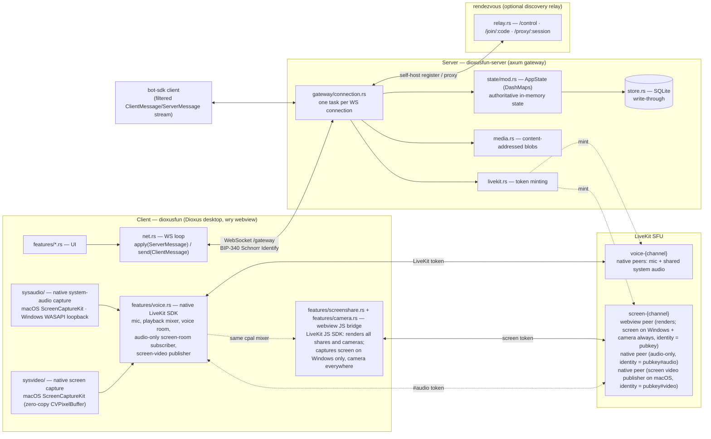

# Discordia — developer guide

Discordia is a **self-hostable, Nostr-identity Discord clone**: text/voice/DMs,
guilds with roles & moderation, a bot platform, and optional decentralization
(any user can run their own server + discovery relay). Rust workspace, Dioxus
desktop client, axum WebSocket server.

This file is the orientation for anyone (human or agent) picking up the repo.
Read it, then `docs/ROADMAP.md` for where the project is headed and
`docs/SELF_HOSTING.md` for ops.

---

## Workspace crates

| Crate | Package | Role |
|-------|---------|------|
| `protocol/` | `dioxusfun-protocol` | **Shared wire types** — the single source of truth for `ClientMessage`/`ServerMessage` and every struct on the wire. Depended on by all others. |
| `server/` | `dioxusfun-server` | axum gateway: WebSocket protocol handling, in-memory state, SQLite persistence, media blobs, LiveKit voice, guild export/import. |
| `client/` | `dioxusfun` | Dioxus 0.7 desktop app (wry webview). Also contains the *host* path — it can spawn an embedded `dioxusfun-server` in-process for self-hosting. |
| `rendezvous/` | `dioxusfun-rendezvous` | Discovery + NAT-traversal relay: hosts register (optionally under a claimed name), friends join by code, frames are proxied. |
| `bot-sdk/` | `dioxusfun-bot` | Thin client library for writing bots (and the test harness — integration tests drive the server through it). |
| `grid-layout/` | `dioxus-grid-layout` | Reusable draggable/resizable grid widget for the client's panel workspace. Self-contained; rarely touched. |

---

## Architecture at a glance



Up to three runtime paths carry audio+video for a screen share, and they all
terminate in the *same* `screen-{channel}` LiveKit room under different
identities — see `server::livekit::screen_audio_identity` /
`screen_video_identity`. Two arrangements there are load-bearing and are
explained once each under **Client anatomy** below, at `sysvideo/` and at the
identity bullets under `features/*.rs`:

- **Which path captures video is per-platform, not a preference** — Windows in
  the webview, macOS natively via `sysvideo/`. The webview joins the room on
  both platforms regardless, because it is what *renders* everyone else's share.
- **The camera is the exception: webview everywhere**, on the bare identity —
  which is why `screen-{channel}` now carries faces as well as screens.

---

## The five things that will bite you if you don't know them

1. **Protocol changes ripple everywhere.** Adding/removing a field on a
   `ClientMessage`/`ServerMessage` variant in `protocol/src/lib.rs` breaks *every*
   construction site. You must update, in lockstep:
   - server handler arm in `server/src/gateway/connection.rs`,
   - client sender in the relevant `client/src/features/*.rs`,
   - client receiver arm in `client/src/net.rs` (`apply()` match — it's
     exhaustive, so new `ServerMessage` variants force a new arm),
   - every test that constructs the message (`server/tests/*.rs`).
   Use `#[serde(default)]` on new optional fields for forward-compat with older
   clients. Messages are `#[serde(tag = "...")]` snake_case-tagged enums.

2. **In-memory state is authoritative; the DB is write-through.** `AppState`
   (`server/src/state/mod.rs`) holds `DashMap`s that are the live truth. Every
   mutation writes through to the `Store` (`server/src/store.rs`, SQLite via
   sqlx) and is rehydrated on boot by `load_or_seed()`. A failed DB write is
   *logged and ignored* (`persist()` helper) — the change survives the session
   but not a restart. **Messages are the exception: they live ONLY in the DB**
   (fetched on demand via `FetchMessages`), never in an in-memory map. Direct
   messages are not here at all any more — see `client/src/nostr/`.

3. **Message images are offloaded to content-addressed blobs.** `MediaStore`
   (`server/src/media.rs`) decodes inbound `data:` URLs into
   `media:<sha256>.<ext>` sentinels stored on disk; they're re-inlined on serve
   and via `GET /media/{name}`. DB rows and broadcasts carry the sentinel, not
   the bytes. (Blob GC is still open.)

4. **Fan-out is a per-connection routing table, not a broadcast.**
   `AppState.deliver(to_pubkeys, msg)` routes only to those users' live
   connections (O(recipients)) via the `conn_ids_by_pubkey` index;
   `broadcast(msg)` hits everyone (now rare — basically only `ProfileUpdate`).
   Each connection has a bounded outbound `mpsc`; if it overflows (slow
   consumer) the connection is **dropped and the client reconnects + gets a
   fresh snapshot**. Connection lifecycle in `gateway/connection.rs`:
   `register_conn` on connect → `identify_conn` *before* sending the Ready
   snapshot (so no concurrently-delivered frame is lost) → `unregister_conn` on
   disconnect.

5. **The server re-checks every permission; the client `can()` is advisory.**
   Never trust the client to gate an action — `state.can(guild, perm)` on the
   client only hides dead-end UI. Authority lives server-side.

---

## Identity & auth (Nostr / BIP-340)

- Identity is a **secp256k1 Schnorr (BIP-340 / Nostr)** keypair. Pubkeys are
  64-char hex (x-only). Client keys live in `client/src/identity.rs`
  (`Identity::sign_hex(msg)` = Schnorr over `SHA256(msg)`).
- The **Identify handshake**: server sends `Hello { nonce }`; client replies
  `Identify { username, pubkey, signature, bot, client_version }` where
  `signature` is Schnorr over `SHA256(nonce || pubkey || username)`. Verified in
  `server/src/auth.rs` (`verify_identify`). This same challenge/sign/verify
  pattern is reused for **rendezvous name ownership**
  (`rendezvous/src/verify.rs`).
  Note what the signature covers and what it does not: `bot` and
  `client_version` are **self-declared and unauthenticated**. That is deliberate
  for both — bot-ness because inferring it from installs would be an attack (see
  the comment at the handler), and the version because it exists to be counted
  in a log, not to gate anything. Neither is evidence.
- There is **no password/account system** — your key *is* your account.
  Anti-abuse is per-guild: join gates (rules / proof-of-work), panic-mode
  lockdown, slowmode, bans, audit log (all Phase 4, in `state/mod.rs` +
  `gateway/connection.rs`).

---

## Server anatomy (`server/src/`)

- `lib.rs` — `ServerConfig`, `build_context`, `serve`/`spawn`. Opens the store &
  media, `load_or_seed`s state, spawns the hourly retention sweep.
- `gateway/connection.rs` — **the heart**: one `handle_connection` per socket, a
  `select!` loop over inbound client messages and the outbound routing queue.
  Every `ClientMessage` has an arm here; every guild event is `deliver`ed to the
  right members. Bots get a filtered stream (`filter_for_bot`).
- `state/mod.rs` — `AppState`: all the DashMaps, the routing table, and every
  mutation method (async, write-through). Permissions engine, guild templates,
  join gates, slowmode, raid detection, audit log live here.
- `store.rs` — SQLite schema + all persistence. `LoadedState` is the boot
  snapshot. Designed to also back Postgres later (only SQLite impl exists).
- `quic.rs` — the second front door: the *same* axum router served over iroh
  QUIC bi-streams, WebSocket upgrade and all. Encrypted, and the host is
  authenticated by its public key rather than by a certificate we would have to
  verify ourselves. `build_router`/`serve_router` in `lib.rs` exist so both
  doors share one router and cannot drift apart.
- `media.rs` — content-addressed blob store (see #3 above).
- `auth.rs` — Schnorr verification. `archive.rs` — guild export/import
  (`export_guild`/`import_guild`, fresh IDs, pubkeys preserved).
- `livekit.rs` / `livekit_bundle.rs` — voice: config + optional bundled
  LiveKit subprocess. `http.rs` — HTTP router: `/gateway` (the WebSocket
  upgrade), `/media/{name}` (blob serve), `/` (health). (Public discovery
  `/discover` lives on the *rendezvous*, not the server.)

## Client anatomy (`client/src/`)

- `main.rs` / `app.rs` — Dioxus entry, theming, top-level layout. `main.rs` also
  owns logging, and where it lands differs by build. Debug prints to the console.
  Release is windowed on Windows (`windows_subsystem`), so there is no console to
  print to: it writes `<config_dir>/logs/discordia.log` — rolled at 5 MB, one
  generation — and that file also receives panics and every `eprintln!` in the
  crate, because the process's own stdout/stderr are redirected onto it.
- `net.rs` — the WebSocket loop. `apply(ServerMessage)` mutates `AppState`; the
  gateway sender pushes `ClientMessage`s. **New server messages are handled
  here.**
- `state.rs` — client-side `AppState` (mirrors server data for rendering) +
  `can()`/`is_owner()` advisory permission helpers.
- `identity.rs` — key gen/import (nsec/hex), signing. `session.rs`,
  `settings.rs` — connection params & local prefs.
- `denoise.rs` — DeepFilterNet 3 mic noise suppression (pure-Rust `tract`,
  weights compiled in). Runs on the voice service's DSP thread, one 10ms hop at
  a time. The tract crates are pinned and get a `[profile.dev.package]`
  optimisation override in the root `Cargo.toml` — read the comment there before
  bumping them, the model won't even load without it.
- `rawmic/` — microphone capture with the OS's own input processing bypassed
  (Windows: WASAPI raw mode, which cpal cannot ask for because the flag is set
  before `Initialize`). Opens the same device the cpal path would and hands the
  samples to the same `forward_mic`, so the two backends differ only in *how the
  device is opened*. That is also why toggling it restarts the voice session:
  raw is fixed at open time, unlike every APM switch beside it. `supported()`
  gates the setting — macOS never had the processing in the path, so the switch
  is hidden rather than inert.
- `sysaudio/` — native system-audio capture for screen sharing, so a share
  carries the machine's sound without depending on the webview's picker.
  `scope()` says how far it reaches per platform (macOS: every share; Windows:
  whole-screen picks only, build 20348+; elsewhere: not at all) and the share
  flow settles which path a given capture takes *after* the picker closes, since
  that answer depends on what the user chose. Frames are mono f32 @48kHz — the
  format `features::voice` already publishes.
- `sysvideo/` — native *screen* capture. macOS only; Windows stays in the
  webview because WebView2 is Chromium and `getDisplayMedia` works there. It
  exists because the webview path was unusable on macOS:
  `navigator.mediaDevices` was absent until we added a usage description to
  Info.plist, which the module docs correct at length — the original "WKWebView
  cannot" diagnosis was ours, not WebKit's. **So the native path stays because
  it is better here, not because the webview cannot:** frames are handed to a
  sink as owned `Frame`s wrapping the `CVPixelBuffer`, which libwebrtc can
  encode directly — no copy, no colour conversion in our process — and the
  surface picker is our own. `supported()` decides which path the share button
  drives; the publisher lives in `features::voice::ScreenVideoRoom`.
  `sources()` enumerates what can be shared and `Target` says which of it to
  capture — screen, one window, or every window of one app, resolved to an
  `SCContentFilter` at capture time. ScreenCaptureKit has no picker of its own
  (Chromium's `getDisplayMedia` was providing that on the webview path), so
  `features::screenshare::ScreenSourcePicker` is our own UI over that list —
  the same division Electron apps like Discord use. Targets are re-resolved from
  a fresh query on every start, because a window can close between the pick and
  the capture.
- `host.rs` — self-host: bind the gateway, ask the router for a way in, register
  with the rendezvous, then decide whether a local LiveKit is needed at all (a
  rendezvous with its own SFU wins, and the bundled one is not started). The
  order is load-bearing: the bound port is what gets mapped and advertised.
  `rendezvous.rs` — the rendezvous client (control handshake + proxy bridging).
  `blossom.rs` — Nostr media upload for avatars/banners.
- `quic.rs` — the client half of the QUIC transport: derive the transport key
  from the Nostr identity (stable, one-way), dial a host by key, hand the stream
  to the ordinary WebSocket handshake. `net::connect_best` prefers it over both
  plaintext paths, which is why the UI can say `private` rather than `direct`.
- `portmap.rs` — UPnP-IGD then NAT-PMP, so a home machine obtains an address the
  internet can dial (`docs/NETWORKING.md`, tier 1 — the only one involving
  nobody else). Failure is the normal case and returns a sentence for the UI,
  never an error that stops hosting. It also measures **hairpin NAT**, because
  LiveKit replaces its LAN ICE candidate with the advertised address rather than
  adding to it — so advertising one without checking would trade the LAN path
  for the remote one.
- `version.rs` — which build this is, stamped by `client/build.rs` at compile
  time. **Not `CARGO_PKG_VERSION`**, which is `0.1.0` in every release ever
  published: the release number lives in the tag CI creates and used to stop
  there. CI sets `DISCORDIA_VERSION` to exactly that tag on the three
  publishing jobs — and deliberately *not* at workflow level, because a check
  job that inherited it would build a binary claiming to be a release nobody
  published. `version.rs` has a test that fails if that happens. Everything
  else calls itself `0.1.0-dev+<sha>`.
- `features/*.rs` — UI, one module per surface: `guilds`, `channels`, `chat`,
  `members`, `voice`, `screenshare`, `camera`, `roles`, `guild_settings`,
  `integrations` (bots), `profiles`, `connect`, `home`, `discover`,
  `appearance`, `activities`.
- **`home` carries two levels, and they are not the same question.**
  *Communities* are guilds inside the host you are connected to
  (`FetchCatalog` → `GuildCatalog`); *servers* are other hosts entirely
  (`GET /discover` on the rendezvous, rendered by `features::discover`, which
  the connect screen and home share so there is one directory and not two).
  `home::primary_explore` decides which of the two home leads with, and the
  reason it reads community membership rather than "am I on a server" is in its
  doc comment: past the connect screen this client is always in a session, so
  the state the rule wants to detect cannot occur (register entry 78).
- **One user joins the screen room under up to three identities, on purpose.**
  LiveKit allows only one connection per identity, so each job that needs its own
  connection needs its own suffix:
  - bare `{pubkey}` — the webview. Renders every share; *captures* the screen on
    Windows, and publishes the **camera** on every platform.
  - `{pubkey}#audio` — native, audio-only, `auto_subscribe: false`. Subscribes to
    stream audio so it plays through the same cpal device as voice. Its token is
    minted **without** publish rights, unlike the other two.
  - `{pubkey}#video` — native, publish-only, `auto_subscribe: false`. Publishes
    natively captured screen video on macOS.

  Watchers resolve a sharer to a track by identity, and our own protocol
  announces sharers by *bare* pubkey — so the `#video` suffix is resolved in one
  place, `attach`/`reattach` in the JS controller. Adding a fourth identity means
  teaching those two functions about it — and deciding what it may publish, which
  `screen_token_as` takes as an argument rather than inferring from the suffix.
  That answer rides `MintRequest::can_publish` across the delegation seam too, so
  it binds on the local mint *and* on a rendezvous-delegated one — with the
  caveat that a relay older than that field ignores it and grants publish, which
  nothing on this wire can detect.

  **The camera deliberately did not add a fourth.** `features/camera.rs`
  captures with `getUserMedia` on macOS and Windows alike and publishes as
  `TrackSource::Camera` on the webview's *existing* connection — the bare
  identity already holds publish rights, so it cost no token, no grant and no
  change to `server::livekit`. If you are about to mint a `#camera` identity to
  "fix" something, that is the thing to reconsider first.
  The price is that every video track in the JS controller is keyed by identity
  **and** source: one participant can send both at once, and on Windows both
  come from the same identity. Who has a camera on rides `camera_on` on
  `VoiceState`, not LiveKit's track events, so it survives a reconnect and
  reaches people who are not in the channel to observe the publication
  themselves.
- **Screen-share audio has two paths into the same room, on purpose.** Both land
  in the same
  cpal mixer voice already uses, so stream audio follows the chosen output
  device instead of being stuck on whatever `setSinkId` support the webview
  has. `AppState.screen_audio_joined` (client) tracks whether the native side
  is *actually in*, not just whether it has a token — a failed/dropped native
  join hands playback back to the webview rather than going silent. See
  `features::voice::ScreenAudioRoom` / `ScreenVideoRoom` and
  `server::livekit::screen_token_as`.
- **The native publications are owned by an effect, not by the share button.**
  On the native path the button only *opens the picker*; the picker sets intent
  (`screen_sharing`, `screen_share_target`, `screen_native_audio`), and the
  effect in `features::screenshare::ScreenShareBridge` issues
  `SetSystemAudio`/`SetScreenVideo`, keyed on the voice-session epoch *and* the
  target. Two things fall out of that: a mid-share device change survives (it
  tears `ActiveVoice` down, and the rebuilt session re-publishes from the effect
  rather than leaving the share silently dead with the button still lit), and
  switching surface mid-share is just a target change — the publisher rebuilds
  against the new one. Anything that ends a share must clear
  `screen_share_target`, or the effect sees an unchanged key and the next click
  does nothing.
- `nostr/` — **direct messages, which no longer touch the gateway at all.** A
  DM is a NIP-17 gift-wrapped event on Nostr relays, so a conversation belongs
  to your key rather than to whichever server you are connected to: change
  servers, self-host, or have the host delete its database, and the history
  follows you. Four layers, each verifiable on its own — `nip44` (the
  encryption, checked against the spec's own test vectors, which is what makes a
  hand-written crypto module a checked claim rather than an assurance), `event`
  (NIP-01 ids and signatures), `nip59` (the gift wrap: rumor → seal → wrap,
  where the outer layer is signed by a **throwaway key**, so a relay learns that
  somebody messaged you and never who), `nip17` (chat semantics — and note every
  message is wrapped *twice*, to them and to us, because a wrap can only be
  opened by the key it was addressed to, including by its sender). `nip02` is
  the contact list, which travels the same way; `relay` is the client;
  `service` is the task that owns it and feeds `AppState`, shaped like
  `net::spawn_gateway` deliberately.
  Two things to know before touching it. The DM views are keyed by `Uuid`
  because they were written for server channels, so `service::conversation_id`
  *derives* one from a pubkey — stable across launches and devices, and the
  reason the whole DM surface kept working unchanged. And **the contact list is
  a public, replaceable event**: publishing a partial list deletes everyone
  missing from it, which is why `ContactList` is read-modify-written whole.
- `protocol/mod.rs` — re-exports `dioxusfun-protocol` so the client says
  `crate::protocol::…`.

## Rendezvous anatomy (`rendezvous/src/`)

- `relay.rs` — the three WS handlers: host `/control` (register), friend
  `/join/{code}`, host `/proxy/{session}` (pairing). `lib.rs` — router & config,
  plus two HTTP reads: `/discover` (public listing) and `/resolve/{code}` (one
  live host by code, listed or not — how a joiner learns the direct address a
  host advertised before deciding whether to use the relay at all).
- `registry.rs` — **live hosts** (ephemeral, keyed by shortcode) vs **name
  reservations** (persistent JSON, owner-scoped, survive restart). `discover()`
  lists only live public hosts.
- `verify.rs` — Schnorr ownership proof for claimed names.
- `shortcode.rs` — `adjective-animal-NN` random codes for anonymous hosts.
- The wire types live in **`protocol/src/rendezvous.rs`**, not here — the host
  side of this protocol is spoken by the client (`client/src/rendezvous.rs`),
  and nothing depends on the relay crate. Same rule as the gateway: one
  definition, in `protocol/`.
- Named servers: a host claims a unique, URL-safe name (its `/join/{name}`
  code) proven by signing the challenge nonce; anonymous hosts get a random
  shortcode. Reservations persist to `<data>/reservations.json`.

---

## Build, run, test

```sh
# Build everything
cargo build --workspace

# Run the standalone server (env-configured; see docs/SELF_HOSTING.md)
cargo run -p dioxusfun-server
#   DIOXUSFUN_ADDR (0.0.0.0:9000), DIOXUSFUN_DATA_DIR (./discordia-data),
#   DIOXUSFUN_OPERATORS (hex pubkeys who moderate system guilds)

# Guild export/import (Phase 6)
cargo run -p dioxusfun-server -- export --guild <uuid> backup.json
cargo run -p dioxusfun-server -- import backup.json

# Run the rendezvous relay
cargo run -p dioxusfun-rendezvous
#   DIOXUSFUN_RENDEZVOUS_ADDR (0.0.0.0:7700),
#   DIOXUSFUN_RENDEZVOUS_DATA_DIR (./rendezvous-data)

# Run the desktop client (Dioxus CLI; install with `cargo install dioxus-cli`)
dx serve --package dioxusfun
# or plain: cargo run -p dioxusfun

# Package the macOS .app + .dmg. Use the script rather than `dx bundle` directly:
# it passes the code-signing identity, which is what makes macOS keep its Screen
# Recording / Microphone / Camera grants across rebuilds instead of treating
# every build as a new app. The identity is per-developer and deliberately not in
# Dioxus.toml — naming one there breaks everyone else's build and all three CI
# pre-release jobs, because dx hands it to `codesign`, which fails hard.
DISCORDIA_SIGNING_IDENTITY="Apple Development: You (TEAMID)" ./bundle-macos.sh
#   security find-identity -v -p codesigning   # lists candidates
#   (unset: still builds, ad-hoc — you re-grant permissions after every build)

# Tests — the whole suite runs headlessly and must stay green
cargo test --workspace
```

**Testing pattern.** Integration tests (`server/tests/*.rs`) spawn a real
gateway (`spawn_gateway()`) and drive it through the bot SDK's
`Bot::connect_as_user` / `connect` — they exercise the actual WebSocket
protocol end to end. Copy an existing test's helper block (`spawn_gateway`,
`connect_user`, `create_guild`, `next_timeout`) when adding one. Each test uses
a unique temp data dir so they're parallel-safe. Current suites: `archive`,
`bots`, `emoji`, `identify`, `owner_controls`, `persistence`,
`rendezvous_voice`, `transport`, `voice` (server) and `handshake`
(rendezvous). **First run is slow** — the server crate gets
`livekit-server` once, and how depends on the platform: Windows and Linux
download the prebuilt release, macOS clones and `go build`s it (~2-3 min, needs
`go` on PATH). Either way a failure **stops the build** rather than warning:
the binary is embedded with `include_bytes!`, so a build without it looks
identical to one with it and quietly cannot host voice locally. Set
`LIVEKIT_BUNDLE_SKIP=1` to opt out on purpose — the panic names it.

`voice` is the one to copy when a test needs something to fail *partway*.
`JoinVoice` mints three JWTs, and one key and secret cannot express "this mint
fails, its siblings succeed". `ScriptedMinter` there implements the same public
`VoiceTokenMinter` trait the rendezvous-delegated path uses and answers per
request, so that delegation seam doubles as a fault injector.

**Some tests are `#[ignore]`d, and they are where the platform paths are
actually verified** — `cargo test -p dioxusfun -- --ignored`.
`client/tests/live_sfu.rs` drives two live peers against a real SFU (its module
docs give the command for pointing it at the bundled one) — and is also where
the audio path gets *measured* rather than asserted: a tone in, the same tone
analysed coming out, and a sweep that reruns that under the APM, `red`, `dtx`,
bitrate and DeepFilterNet-ceiling settings so a claim about voice quality has a
number behind it — read that sweep's own note before trusting a row, because the
ceiling dimension is what showed the model saturating on a signal it hears no
speech in;
`windows_loopback_delivers_real_samples` needs an audio device and a desktop
session; the macOS `frames_survive_the_encoder_handoff` needs the Screen
Recording grant and a display. They are ignored because no runner has any of
that, which is what keeps `cargo test --workspace` headless — not a sign they
are optional. The Windows one found a heap corruption in shipped code the first
time anyone ran it.

---

## Conventions

- **Comment only where it is actually needed, and only the *why*.** Never the
  *what* — the code already says that, and a comment restating it is a second
  copy to keep true. Write one when the reason is not recoverable by reading
  the code: a decision that looks wrong until you know the constraint, an
  ordering that is load-bearing, a trap the next person would otherwise walk
  back into. Everywhere else, say nothing. Density is not the goal and was
  never evidence of care; this codebase over-commented for a long time and is
  being trimmed back to the lines that earn their place.
- **Never add Claude/AI attribution** to commits, PRs, or generated content.
- **Deferred work goes in the register, not only in the commit message.** The
  register is §8 of `docs/AUDIT-2026-08-17.md`. If something is knowingly left
  undone — a review follow-up, a gap you chose not to close, a fix you could not
  verify — it goes there, with the check that would settle it. Commit bodies in
  this repo are unusually good, which is the trap: they are written once and read
  never, so recording a decision in one *feels* like tracking it. `c86af67`
  listed five review follow-ups in its body; three were still open a month later
  and nothing anywhere was tracking them. Same for a bug you find and don't fix —
  `c6cb994` wrote "That is still open" about a user-reported problem, and that
  was the last anyone looked at it (it is entry 66 now). This used to be
  `TODO.md`, which was removed, and for four days the convention pointed at an
  issue tracker that has never had a single issue in it — which is how the
  lesson nearly died a second time.
- Mutations on `AppState` are `async` and write through to the store — follow
  the existing method shape (mutate map → `persist(store.xxx().await, "what")`).
- Prefer `deliver(guild_member_pubkeys, msg)` over `broadcast` for guild
  events — keep fan-out targeted.
- Keep `protocol` the single source of truth; don't redefine wire structs.

## Status & where to look next

`docs/ROADMAP.md` has the authoritative phase status. In short: persistence
(P1), deploy artifacts (P2), community safety (P4), catalog-on-demand (P5b),
the transport bus (P5a core), guild export/import + persistent named rendezvous
(P6 parts) are **done and tested**. Deliberately deferred / gated: the web-PWA
client (P3, needs a browser), delta-sync resume + a 2k-connection load
benchmark (P5a tail), the signed "guild-moved" redirect + cross-instance media
copy (P6 tail), and cluster mode (P7, demand-gated).

Contributing workflow (fork, branch, PR) is in `README.md`.
