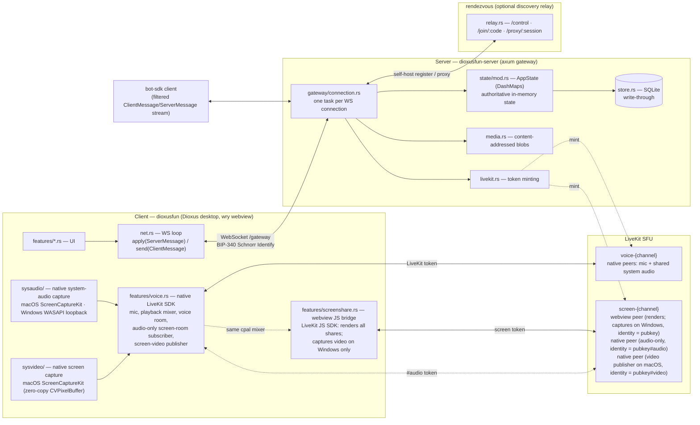

# Discordia — developer guide

Discordia is a **self-hostable, Nostr-identity Discord clone**: text/voice/DMs,
guilds with roles & moderation, a bot platform, and optional decentralization
(any user can run their own server + discovery relay). Rust workspace, Dioxus
desktop client, axum WebSocket server.

This file is the orientation for anyone (human or agent) picking up the repo.
Read it, then `docs/ROADMAP.md` for where the project is headed and
`docs/SELF_HOSTING.md` for ops. `TODO.md` tracks deliberately-deferred work.

---

## Workspace crates

| Crate | Package | Role |
|-------|---------|------|
| `protocol/` | `dioxusfun-protocol` | **Shared wire types** — the single source of truth for `ClientMessage`/`ServerMessage` and every struct on the wire. Depended on by all others. |
| `server/` | `dioxusfun-server` | axum gateway: WebSocket protocol handling, in-memory state, SQLite persistence, media blobs, LiveKit voice, guild export/import. |
| `client/` | `dioxusfun` | Dioxus 0.7 desktop app (wry webview). Also contains the *host* path — it can spawn an embedded `dioxusfun-server` in-process for self-hosting. |
| `rendezvous/` | `dioxusfun-rendezvous` | Discovery + NAT-traversal relay: hosts register (optionally under a claimed name), friends join by code, frames are proxied. |
| `bot-sdk/` | `dioxusfun-bot` | Thin client library for writing bots (and the test harness — integration tests drive the server through it). |
| `grid-layout/` | `dioxus-grid-layout` | Reusable draggable/resizable grid widget for the client's panel workspace. Self-contained; rarely touched. |

---

## Architecture at a glance



Up to three runtime paths carry audio+video for a screen share, and they all
terminate in the *same* `screen-{channel}` LiveKit room under different
identities — see `server::livekit::screen_audio_identity` /
`screen_video_identity` and the `sysaudio/` + `sysvideo/` notes below.

**Which path captures video is per-platform, and it is not a preference.**
Windows uses the webview (WebView2 is Chromium, `getDisplayMedia` works there).
macOS captures natively via `sysvideo/` instead. Originally because
`navigator.mediaDevices` was absent there — which turned out to be a missing
`NSMicrophoneUsageDescription` in our own bundle, not a WKWebView limitation;
adding it makes `getDisplayMedia` appear. The native path stays because it is
better here (no copy, no colour conversion, our own surface picker), not because
the webview cannot. The webview still joins the room on both platforms, because
it is what *renders* everyone else's share.

---

## The five things that will bite you if you don't know them

1. **Protocol changes ripple everywhere.** Adding/removing a field on a
   `ClientMessage`/`ServerMessage` variant in `protocol/src/lib.rs` breaks *every*
   construction site. You must update, in lockstep:
   - server handler arm in `server/src/gateway/connection.rs`,
   - client sender in the relevant `client/src/features/*.rs`,
   - client receiver arm in `client/src/net.rs` (`apply()` match — it's
     exhaustive, so new `ServerMessage` variants force a new arm),
   - every test that constructs the message (`server/tests/*.rs`).
   Use `#[serde(default)]` on new optional fields for forward-compat with older
   clients. Messages are `#[serde(tag = "...")]` snake_case-tagged enums.

2. **In-memory state is authoritative; the DB is write-through.** `AppState`
   (`server/src/state/mod.rs`) holds `DashMap`s that are the live truth. Every
   mutation writes through to the `Store` (`server/src/store.rs`, SQLite via
   sqlx) and is rehydrated on boot by `load_or_seed()`. A failed DB write is
   *logged and ignored* (`persist()` helper) — the change survives the session
   but not a restart. **Messages are the exception: they live ONLY in the DB**
   (fetched on demand via `FetchMessages`), never in an in-memory map.

3. **Message images are offloaded to content-addressed blobs.** `MediaStore`
   (`server/src/media.rs`) decodes inbound `data:` URLs into
   `media:<sha256>.<ext>` sentinels stored on disk; they're re-inlined on serve
   and via `GET /media/{name}`. DB rows and broadcasts carry the sentinel, not
   the bytes. (Blob GC is still open — see `TODO.md`.)

4. **Fan-out is a per-connection routing table, not a broadcast.**
   `AppState.deliver(to_pubkeys, msg)` routes only to those users' live
   connections (O(recipients)) via the `conn_ids_by_pubkey` index;
   `broadcast(msg)` hits everyone (now rare — basically only `ProfileUpdate`).
   Each connection has a bounded outbound `mpsc`; if it overflows (slow
   consumer) the connection is **dropped and the client reconnects + gets a
   fresh snapshot**. Connection lifecycle in `gateway/connection.rs`:
   `register_conn` on connect → `identify_conn` *before* sending the Ready
   snapshot (so no concurrently-delivered frame is lost) → `unregister_conn` on
   disconnect.

5. **The server re-checks every permission; the client `can()` is advisory.**
   Never trust the client to gate an action — `state.can(guild, perm)` on the
   client only hides dead-end UI. Authority lives server-side.

---

## Identity & auth (Nostr / BIP-340)

- Identity is a **secp256k1 Schnorr (BIP-340 / Nostr)** keypair. Pubkeys are
  64-char hex (x-only). Client keys live in `client/src/identity.rs`
  (`Identity::sign_hex(msg)` = Schnorr over `SHA256(msg)`).
- The **Identify handshake**: server sends `Hello { nonce }`; client replies
  `Identify { username, pubkey, signature, bot }` where `signature` is Schnorr
  over `SHA256(nonce || pubkey || username)`. Verified in `server/src/auth.rs`
  (`verify_identify`). This same challenge/sign/verify pattern is reused for
  **rendezvous name ownership** (`rendezvous/src/verify.rs`).
- There is **no password/account system** — your key *is* your account.
  Anti-abuse is per-guild: join gates (rules / proof-of-work), panic-mode
  lockdown, slowmode, bans, audit log (all Phase 4, in `state/mod.rs` +
  `gateway/connection.rs`).

---

## Server anatomy (`server/src/`)

- `lib.rs` — `ServerConfig`, `build_context`, `serve`/`spawn`. Opens the store &
  media, `load_or_seed`s state, spawns the hourly retention sweep.
- `gateway/connection.rs` — **the heart**: one `handle_connection` per socket, a
  `select!` loop over inbound client messages and the outbound routing queue.
  Every `ClientMessage` has an arm here; every guild event is `deliver`ed to the
  right members. Bots get a filtered stream (`filter_for_bot`).
- `state/mod.rs` — `AppState`: all the DashMaps, the routing table, and every
  mutation method (async, write-through). Permissions engine, guild templates,
  join gates, slowmode, raid detection, audit log live here.
- `store.rs` — SQLite schema + all persistence. `LoadedState` is the boot
  snapshot. Designed to also back Postgres later (only SQLite impl exists).
- `media.rs` — content-addressed blob store (see #3 above).
- `auth.rs` — Schnorr verification. `archive.rs` — guild export/import
  (`export_guild`/`import_guild`, fresh IDs, pubkeys preserved).
- `livekit.rs` / `livekit_bundle.rs` — voice: config + optional bundled
  LiveKit subprocess. `http.rs` — HTTP router: `/gateway` (the WebSocket
  upgrade), `/media/{name}` (blob serve), `/` (health). (Public discovery
  `/discover` lives on the *rendezvous*, not the server.)

## Client anatomy (`client/src/`)

- `main.rs` / `app.rs` — Dioxus entry, theming, top-level layout.
- `net.rs` — the WebSocket loop. `apply(ServerMessage)` mutates `AppState`; the
  gateway sender pushes `ClientMessage`s. **New server messages are handled
  here.**
- `state.rs` — client-side `AppState` (mirrors server data for rendering) +
  `can()`/`is_owner()` advisory permission helpers.
- `identity.rs` — key gen/import (nsec/hex), signing. `session.rs`,
  `settings.rs` — connection params & local prefs.
- `denoise.rs` — DeepFilterNet 3 mic noise suppression (pure-Rust `tract`,
  weights compiled in). Runs on the voice service's DSP thread, one 10ms hop at
  a time. The tract crates are pinned and get a `[profile.dev.package]`
  optimisation override in the root `Cargo.toml` — read the comment there before
  bumping them, the model won't even load without it.
- `sysaudio/` — native system-audio capture for screen sharing, so a share
  carries the machine's sound without depending on the webview's picker.
  `scope()` says how far it reaches per platform (macOS: every share; Windows:
  whole-screen picks only, build 20348+; elsewhere: not at all) and the share
  flow settles which path a given capture takes *after* the picker closes, since
  that answer depends on what the user chose. Frames are mono f32 @48kHz — the
  format `features::voice` already publishes.
- `sysvideo/` — native *screen* capture. macOS only, and it exists because the
  webview path was unusable there: `navigator.mediaDevices` was absent until we
  added a usage description to Info.plist, which the module docs correct at
  length — the original "WKWebView cannot" diagnosis was ours, not WebKit's.
  Frames are handed to a sink as owned `Frame`s wrapping the `CVPixelBuffer`,
  which libwebrtc can encode directly — no copy, no colour conversion in our
  process. `supported()` decides which path the share button drives; the
  publisher lives in `features::voice::ScreenVideoRoom`.
  `sources()` enumerates what can be shared and `Target` says which of it to
  capture — screen, one window, or every window of one app, resolved to an
  `SCContentFilter` at capture time. ScreenCaptureKit has no picker of its own
  (Chromium's `getDisplayMedia` was providing that on the webview path), so
  `features::screenshare::ScreenSourcePicker` is our own UI over that list —
  the same division Electron apps like Discord use. Targets are re-resolved from
  a fresh query on every start, because a window can close between the pick and
  the capture.
- `host.rs` — self-host: spawn embedded server + LiveKit, register with
  rendezvous. `rendezvous.rs` — the rendezvous client (control handshake +
  proxy bridging). `blossom.rs` — Nostr media upload for avatars/banners.
- `features/*.rs` — UI, one module per surface: `guilds`, `channels`, `chat`,
  `members`, `voice`, `screenshare`, `roles`, `guild_settings`, `integrations`
  (bots), `profiles`, `connect`, `appearance`, `activities`.
- **One user joins the screen room under up to three identities, on purpose.**
  LiveKit allows only one connection per identity, so each job that needs its own
  connection needs its own suffix:
  - bare `{pubkey}` — the webview. Renders every share; also *captures* on
    Windows.
  - `{pubkey}#audio` — native, audio-only, `auto_subscribe: false`. Subscribes to
    stream audio so it plays through the same cpal device as voice. Its token is
    minted **without** publish rights, unlike the other two.
  - `{pubkey}#video` — native, publish-only, `auto_subscribe: false`. Publishes
    natively captured screen video on macOS.

  Watchers resolve a sharer to a track by identity, and our own protocol
  announces sharers by *bare* pubkey — so the `#video` suffix is resolved in one
  place, `attach`/`reattach` in the JS controller. Adding a fourth identity means
  teaching those two functions about it — and deciding what it may publish, which
  `screen_token_as` takes as an argument rather than inferring from the suffix.
  That only binds on the local mint; a rendezvous-delegated one signs its own
  grants (see `TODO.md`).
- **Screen-share audio has two paths into the same room, on purpose.** Both land
  in the same
  cpal mixer voice already uses, so stream audio follows the chosen output
  device instead of being stuck on whatever `setSinkId` support the webview
  has. `AppState.screen_audio_joined` (client) tracks whether the native side
  is *actually in*, not just whether it has a token — a failed/dropped native
  join hands playback back to the webview rather than going silent. See
  `features::voice::ScreenAudioRoom` / `ScreenVideoRoom` and
  `server::livekit::screen_token_as`.
- **The native publications are owned by an effect, not by the share button.**
  On the native path the button only *opens the picker*; the picker sets intent
  (`screen_sharing`, `screen_share_target`, `screen_native_audio`), and the
  effect in `features::screenshare::ScreenShareBridge` issues
  `SetSystemAudio`/`SetScreenVideo`, keyed on the voice-session epoch *and* the
  target. Two things fall out of that: a mid-share device change survives (it
  tears `ActiveVoice` down, and the rebuilt session re-publishes from the effect
  rather than leaving the share silently dead with the button still lit), and
  switching surface mid-share is just a target change — the publisher rebuilds
  against the new one. Anything that ends a share must clear
  `screen_share_target`, or the effect sees an unchanged key and the next click
  does nothing.
- `protocol/mod.rs` — re-exports `dioxusfun-protocol` so the client says
  `crate::protocol::…`.

## Rendezvous anatomy (`rendezvous/src/`)

- `relay.rs` — the three WS handlers: host `/control` (register), friend
  `/join/{code}`, host `/proxy/{session}` (pairing). `lib.rs` — router & config.
- `registry.rs` — **live hosts** (ephemeral, keyed by shortcode) vs **name
  reservations** (persistent JSON, owner-scoped, survive restart). `discover()`
  lists only live public hosts.
- `verify.rs` — Schnorr ownership proof for claimed names.
- `shortcode.rs` — `adjective-animal-NN` random codes for anonymous hosts.
- The wire types live in **`protocol/src/rendezvous.rs`**, not here — the host
  side of this protocol is spoken by the client (`client/src/rendezvous.rs`),
  and nothing depends on the relay crate. Same rule as the gateway: one
  definition, in `protocol/`.
- Named servers: a host claims a unique, URL-safe name (its `/join/{name}`
  code) proven by signing the challenge nonce; anonymous hosts get a random
  shortcode. Reservations persist to `<data>/reservations.json`.

---

## Build, run, test

```sh
# Build everything
cargo build --workspace

# Run the standalone server (env-configured; see docs/SELF_HOSTING.md)
cargo run -p dioxusfun-server
#   DIOXUSFUN_ADDR (0.0.0.0:9000), DIOXUSFUN_DATA_DIR (./discordia-data),
#   DIOXUSFUN_OPERATORS (hex pubkeys who moderate system guilds)

# Guild export/import (Phase 6)
cargo run -p dioxusfun-server -- export --guild <uuid> backup.json
cargo run -p dioxusfun-server -- import backup.json

# Run the rendezvous relay
cargo run -p dioxusfun-rendezvous
#   DIOXUSFUN_RENDEZVOUS_ADDR (0.0.0.0:7700),
#   DIOXUSFUN_RENDEZVOUS_DATA_DIR (./rendezvous-data)

# Run the desktop client (Dioxus CLI; install with `cargo install dioxus-cli`)
dx serve --package dioxusfun
# or plain: cargo run -p dioxusfun

# Package the macOS .app + .dmg. Use the script rather than `dx bundle` directly:
# it passes the code-signing identity, which is what makes macOS keep its Screen
# Recording / Microphone grants across rebuilds instead of treating every build
# as a new app. The identity is per-developer and deliberately not in
# Dioxus.toml — naming one there breaks everyone else's build and all three CI
# pre-release jobs, because dx hands it to `codesign`, which fails hard.
DISCORDIA_SIGNING_IDENTITY="Apple Development: You (TEAMID)" ./bundle-macos.sh
#   security find-identity -v -p codesigning   # lists candidates
#   (unset: still builds, ad-hoc — you re-grant permissions after every build)

# Tests — the whole suite runs headlessly and must stay green
cargo test --workspace
```

**Testing pattern.** Integration tests (`server/tests/*.rs`) spawn a real
gateway (`spawn_gateway()`) and drive it through the bot SDK's
`Bot::connect_as_user` / `connect` — they exercise the actual WebSocket
protocol end to end. Copy an existing test's helper block (`spawn_gateway`,
`connect_user`, `create_guild`, `next_timeout`) when adding one. Each test uses
a unique temp data dir so they're parallel-safe. Current suites: `archive`,
`bots`, `emoji`, `owner_controls`, `persistence`, `transport` (server) and
`handshake` (rendezvous). **First run is slow** — the server crate gets
`livekit-server` once, and how depends on the platform: Windows and Linux
download the prebuilt release, macOS clones and `go build`s it (~2-3 min, needs
`go` on PATH). Either way a failure **stops the build** rather than warning:
the binary is embedded with `include_bytes!`, so a build without it looks
identical to one with it and quietly cannot host voice locally. Set
`LIVEKIT_BUNDLE_SKIP=1` to opt out on purpose — the panic names it.

---

## Conventions

- **Match the surrounding code.** Comments explain *why*, not *what*, and the
  codebase is fairly densely commented at decision points — keep that up.
- **Never add Claude/AI attribution** to commits, PRs, or generated content.
- Mutations on `AppState` are `async` and write through to the store — follow
  the existing method shape (mutate map → `persist(store.xxx().await, "what")`).
- Prefer `deliver(guild_member_pubkeys, msg)` over `broadcast` for guild
  events — keep fan-out targeted.
- Keep `protocol` the single source of truth; don't redefine wire structs.

## Status & where to look next

`docs/ROADMAP.md` has the authoritative phase status. In short: persistence
(P1), deploy artifacts (P2), community safety (P4), catalog-on-demand (P5b),
the transport bus (P5a core), guild export/import + persistent named rendezvous
(P6 parts) are **done and tested**. Deliberately deferred / gated: the web-PWA
client (P3, needs a browser), delta-sync resume + a 2k-connection load
benchmark (P5a tail), the signed "guild-moved" redirect + cross-instance media
copy (P6 tail), and cluster mode (P7, demand-gated). See `TODO.md` for the
smaller deferred items.

---

## How to Contribute

We welcome contributions from anyone who is interested in improving Discordia. Here are some guidelines to get you started:

### Getting Started

1. **Fork the Repository**: Click on the "Fork" button at the top right of this repository page.
2. **Clone Your Fork**: Clone your forked repository to your local machine using `git clone`.
3. **Set Up Your Environment**: `README.md` is the project overview; this file (`CLAUDE.md`) is the setup/orientation doc. See "Build, run, test" above and `docs/SELF_HOSTING.md` for deploying a server.

### Making Changes

1. **Create a New Branch**: For each new feature or bug fix, create a new branch from the main branch.
   ```sh
   git checkout -b my-new-feature
   ```
2. **Make Your Changes**: Implement your changes and ensure that they follow the coding conventions outlined in this guide.
3. **Test Your Changes**: Run the test suite to make sure your changes do not break existing functionality.
   ```sh
   cargo test --workspace
   ```

### Submitting a Pull Request

1. **Commit Your Changes**: Commit your changes with a descriptive commit message.
   ```sh
   git commit -m "Add new feature"
   ```
2. **Push to Your Fork**: Push your branch to your forked repository.
   ```sh
   git push origin my-new-feature
   ```
3. **Create a Pull Request**: Go to the original repository and create a pull request from your branch.

### Code Review

- Be prepared for feedback on your changes during code review.
- Make any necessary adjustments based on the feedback provided.

---

We appreciate your contributions and look forward to working with you!
