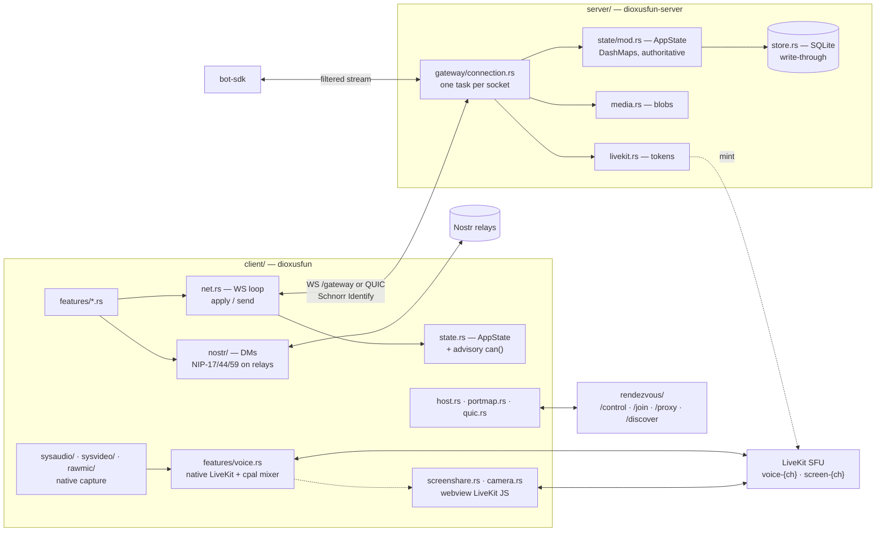

# Discordia

Self-hostable Discord clone with Nostr identity. Rust workspace, Dioxus desktop
client, axum WebSocket server. Text/voice/DMs, guilds, roles, bots, optional
decentralisation.

## Rules

**Comments — only *why*, never *what*.**

- The code already says what it does. A comment restating it is a second copy to
  keep true. Say nothing.
- Write one only when the reason is unrecoverable from the code: a decision that
  looks wrong until you know the constraint, a load-bearing ordering, a trap.
- **Max 2 lines.** Needs more? It is a `docs/OPEN.md` entry, not a comment.
- Delete rather than update a comment you cannot justify in one sentence.

**Docs — terse.** Prefer a table or a mermaid chart to prose. No file restates
another. Deferred work goes in `docs/OPEN.md`, never only in a commit message.

**No Claude/AI attribution** in commits, PRs, or generated content.

## Crates

| Crate | Package | Role |
|---|---|---|
| `protocol/` | `dioxusfun-protocol` | Wire types. Single source of truth for `ClientMessage`/`ServerMessage`. |
| `server/` | `dioxusfun-server` | axum gateway: WS protocol, state, SQLite, media blobs, LiveKit, export/import. |
| `client/` | `dioxusfun` | Dioxus 0.7 desktop app (wry). Also the self-host path — embeds the server in-process. |
| `rendezvous/` | `dioxusfun-rendezvous` | Discovery + NAT relay: hosts register, friends join by code, frames proxied. |
| `bot-sdk/` | `dioxusfun-bot` | Bot client library; integration tests drive the server through it. |
| `grid-layout/` | `dioxus-grid-layout` | Draggable/resizable grid widget. Self-contained. |

## Architecture



## Traps

| # | Invariant |
|---|---|
| 1 | A protocol change ripples: `protocol/src/lib.rs` → server arm in `gateway/connection.rs` → client sender in `features/*.rs` → client arm in `net::apply` → `server/tests/*`. `#[serde(default)]` on new optional fields. |
| 2 | Server memory is authoritative; SQLite is write-through and a failed write is logged and ignored. **Messages live only in the DB**, fetched on demand. |
| 3 | Message images become `media:<sha256>.<ext>` sentinels on disk; rows and broadcasts carry the sentinel, not bytes. |
| 4 | Fan-out is `deliver(pubkeys, msg)` against a routing table, not `broadcast`. A full outbound queue drops the connection; the client reconnects and re-snapshots. `identify_conn` runs *before* the Ready snapshot. |
| 5 | The server re-checks every permission. Client `can()` only hides dead-end UI. |
| 6 | `key` on a lone component does nothing — Dioxus reads it only in a list. `App` renders `WorkspaceView` inside a one-element `for` so a session change remounts it. |
| 7 | DMs never touch the gateway. `ConnectionStatus::Offline` is a state the app *runs in*; home works with no server. |
| 8 | A person's name is resolved at render, never stored: roster → petname → kind 0 → truncated key. `DmInfo` holds a pubkey for that reason. |
| 9 | A relay subscription is replaced by its id, so `RelayPool::subscribe` takes one. The contact list is replaceable — read-modify-write it whole. |
| 10 | One user joins `screen-{ch}` under up to 3 identities (LiveKit allows one connection each): bare = webview (renders all, captures screen on Windows, publishes camera everywhere), `#audio` = native subscriber, `#video` = native macOS screen publisher. Watchers resolve the suffix in `attach`/`reattach` only. |
| 11 | Native share publications are owned by `ScreenShareBridge`'s effect, keyed on voice epoch + target — not by the button. Anything ending a share must clear `screen_share_target`. |
| 12 | Identity is a BIP-340 keypair; your key is your account. `bot` and `client_version` in `Identify` are self-declared and unauthenticated by design. |
| 13 | Tailwind is dx's, not npm's: it finds `client/tailwind.css` at the crate root, installs a standalone CLI, and writes `client/assets/tailwind.css` — which is committed because a plain `cargo build` has no dx to generate it. |

## Build, run, test

```sh
cargo build --workspace
cargo test --workspace          # must stay green and headless
cargo test -p dioxusfun -- --ignored   # platform paths: live SFU, audio device, screen grant
cargo clippy --workspace --all-targets -- -D warnings
cargo fmt --all

cargo run -p dioxusfun-server            # DIOXUSFUN_{ADDR,DATA_DIR,OPERATORS}
cargo run -p dioxusfun-rendezvous        # DIOXUSFUN_RENDEZVOUS_{ADDR,DATA_DIR}
dx serve --package dioxusfun             # dx also runs the Tailwind watcher
cargo run -p dioxusfun                   # no watcher: new classes need one dx build

DISCORDIA_SIGNING_IDENTITY="Apple Development: You (TEAMID)" ./bundle-macos.sh
```

First `cargo test` is slow: `server/` fetches or builds `livekit-server` once
(macOS builds from source, needs `go`). A failure stops the build on purpose —
`LIVEKIT_BUNDLE_SKIP=1` opts out.

Integration tests spawn a real gateway and drive it through the bot SDK; copy an
existing helper block in `server/tests/`. `server/tests/voice.rs::ScriptedMinter`
is the one to copy when a test needs a partial failure.

See `docs/OPS.md` for hosting and networking, `docs/OPEN.md` for what is
deferred, `README.md` for contributing.
