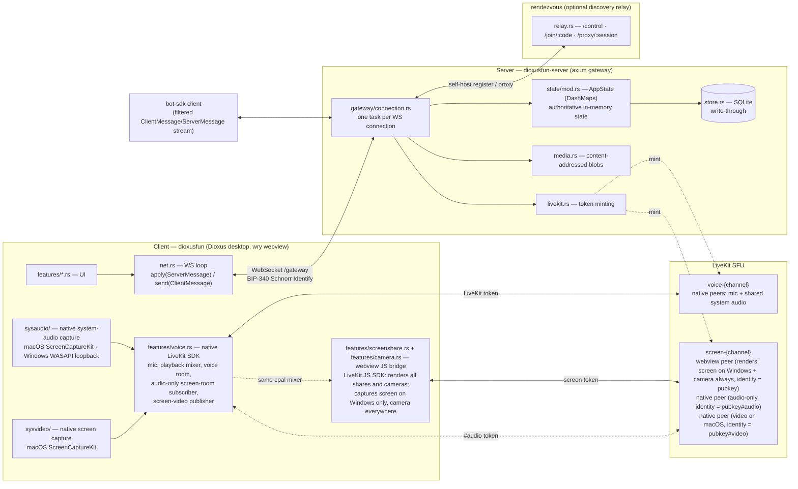

# Discordia

[](https://github.com/ssotomayor/discordia/actions/workflows/ci.yml)

A self-hostable Discord alternative where **your keypair is your account**.

Text and voice channels, DMs, guilds with roles and moderation, screen sharing
with system audio, and a bot platform — in a Rust workspace with a native
desktop client. No signup, no password, no e-mail: identity is a Nostr
(BIP-340 / secp256k1 Schnorr) keypair you hold, so the same identity works on
every instance and no operator can take it from you.

Run it three ways, all the same binary: **one click** inside the client for a
friend group, **one box** with Docker for a community, or a **cluster** when a
community is big enough to need one.

> **Status: pre-release, in active development.** Persistence, moderation,
> voice, screen sharing, bots, and guild export/import all work and are covered
> by the test suite. There is no web client yet, and no hosted instance —
> see [Status](#status) for the honest breakdown.

---

## Why it exists

Discord owns your identity, your community's data, and the terms under which
both survive. Discordia splits those apart:

- **Identity is yours.** A secp256k1 keypair, Nostr-compatible. Import an
  existing `nsec` or generate one. There is no account system to lock you out
  of, and no ID verification to submit to.
- **The data is your operator's**, not a platform's. A guild lives on the
  server that hosts it, and `export`/`import` moves it — with pubkeys intact —
  to a different one.
- **Hosting scales with the community, not up front.** The one-click path
  spawns a real gateway and a real SFU inside the client. Growing out of it
  means moving a directory, not re-onboarding your users.

Self-hosted is not the same as decentralized, and the project is deliberate
about the difference: decentralization lives in the portable identity and the
federation of independent instances. A community's data is centralized with
whoever runs its server, by design.

---

## Features

**Chat** — guild text channels, replies, emoji reactions, custom guild emoji,
message images stored once and content-addressed, per-guild retention with an
hourly sweep that actually reclaims disk.

**Direct messages that no server can read** — a DM is not a row in some
operator's database. It is a NIP-17 gift-wrapped event on Nostr relays,
encrypted with NIP-44, and it never touches the gateway. The conversation
belongs to your key, so it follows you to another instance, to your own
self-host, or to any other Nostr client — and the relay carrying it learns only
that *somebody* messaged you, because the outer event is signed by a throwaway
key. You can also start a conversation with any npub, whether or not you share
a guild. Your contact list travels the same way (NIP-02), with the caveat the
UI states plainly: the contact list is public, the messages are not.

**Voice** — LiveKit-backed voice channels with real SFU media, DeepFilterNet 3
noise suppression on the mic (pure Rust, weights compiled in), and per-user
output gain.

**Screen sharing with sound** — the machine's audio travels with the share, not
just the tab's: ScreenCaptureKit on macOS, WASAPI loopback on Windows. Stream
audio plays through the same output device as voice.

**Camera** — share your webcam in a voice channel, with a per-stream switch in
the roster so you can watch one person's face and someone else's screen at once.
Who has a camera on rides the voice state rather than LiveKit's track events, so
it survives a reconnect and reaches people who aren't in the channel to see the
publication themselves.

**Guilds and moderation** — roles and a server-enforced permission engine, bans,
per-channel slowmode, panic-mode lockdown with automatic raid detection, a
persistent audit log, and join gates (open / rules / SHA-256 proof-of-work) so a
keygen raid costs something. Guild templates for friend-group, FOSS-project and
community shapes.

**Bots** — an external WebSocket client identified by the same kind of pubkey a
user has, so there is no bearer token to leak. Owners install a bot by pubkey
and grant permissions (what it may do) and intents (what it receives, with
message content privileged). Write one with the `dioxusfun-bot` crate.

**Activities** — mini-apps in a sandboxed iframe with no same-origin access,
reaching the client only through a capability-checked RPC bridge the user
approves at launch.

**Discovery** — an optional rendezvous relay makes a laptop-hosted server
reachable without port forwarding or sharing an IP. Hosts get a random
`purple-fox-42` shortcode, or claim a persistent name proven by signing a
challenge with their key.

---

## Architecture



A few load-bearing decisions the diagram implies:

- **In-memory state is authoritative; SQLite is write-through.** `AppState`
  holds the live truth and every mutation writes through to the store, which is
  rehydrated on boot. Messages are the exception — they live only in the DB and
  are fetched on demand.
- **Fan-out is a routing table, not a broadcast.** Guild events are delivered to
  exactly the connections of the members that should see them.
- **The server re-checks every permission.** The client's `can()` only hides
  dead-end UI; authority is server-side.
- **A screen share joins the same LiveKit room under up to three identities.**
  LiveKit allows one connection per identity, so each job that needs its own
  connection gets its own suffix: the webview renders everyone's share (and
  captures the video on Windows, where WebView2 is Chromium and
  `getDisplayMedia` works), a native audio-only peer joins as `#audio` so stream
  sound follows your chosen output device instead of the webview's, and on macOS
  a native `#video` peer publishes frames captured through ScreenCaptureKit.
  Which side captures video is per-platform, not a preference.
- **The camera deliberately did not add a fourth identity.** It publishes on the
  webview's existing connection as a `TrackSource::Camera` track, which the bare
  identity already had the rights for — so it cost no extra token, no new grant
  and no server change. If you are about to mint a `#camera` identity to fix
  something, that is the decision to reconsider first. The price paid instead is
  that video tracks have to be keyed by identity *and* source, since one
  participant can send a screen and a face at the same time.

---

## Quick start

### Just use it

Build the client, open it, pick **Self-host** → Launch. The client spawns a
gateway and a bundled LiveKit server in-process; you are the operator of your
own Lobby. Optionally tick the rendezvous box to get a join code friends can
use without your IP.

```bash
cargo install dioxus-cli
dx serve --package dioxusfun
```

Durable data lands in `<config dir>/dioxusfun/host-data/` and survives restarts.

### Run a server

```bash
cargo run -p dioxusfun-server
```

Listens on `0.0.0.0:9000`; clients connect from the **URL** tab. Configure with
`DIOXUSFUN_ADDR`, `DIOXUSFUN_DATA_DIR` and `DIOXUSFUN_OPERATORS` — see
[docs/SELF_HOSTING.md](docs/SELF_HOSTING.md) for the Docker path, the full
environment reference, and storage governance.

### Run the discovery relay

```bash
cargo run -p dioxusfun-rendezvous
```

See [rendezvous/README.md](rendezvous/README.md) for the protocol and endpoints.

### Move a guild between instances

```bash
cargo run -p dioxusfun-server -- export --guild <uuid> backup.json
cargo run -p dioxusfun-server -- import backup.json
```

Fresh ids, pubkeys preserved — members keep their identity on the new host.

---

## Workspace

| Crate | Package | Role |
|-------|---------|------|
| `protocol/` | `dioxusfun-protocol` | Shared wire types — the single source of truth for every frame on the gateway, and for the rendezvous protocol. Depends on nothing heavy, so a bot author can pull it in alone. |
| `server/` | `dioxusfun-server` | axum gateway: WebSocket protocol, in-memory state, SQLite persistence, media blobs, LiveKit voice, guild export/import. |
| `client/` | `dioxusfun` | Dioxus 0.7 desktop app. Also contains the host path — it can spawn an embedded server in-process for self-hosting. |
| `rendezvous/` | `dioxusfun-rendezvous` | Discovery + NAT-traversal relay: hosts register (optionally under a claimed name), friends join by code, frames are proxied. |
| `bot-sdk/` | `dioxusfun-bot` | Thin client library for writing bots — and the test harness the integration suites drive the server through. |
| `grid-layout/` | `dioxus-grid-layout` | Reusable draggable/resizable grid widget for the client's panel workspace. |

## Build and test

```bash
cargo build --workspace
cargo test --workspace
```

The whole suite runs headlessly and is expected to stay green. **The first build
is slow** — the server crate fetches `livekit-server` once (downloaded on
Windows and Linux, built from source on macOS, which needs `go`). It is embedded
in the binary so one-click self-hosting needs nothing installed; if it cannot be
had, the build stops rather than producing a client that silently cannot host
voice. `LIVEKIT_BUNDLE_SKIP=1` opts out.

Integration tests spawn a real gateway and drive it through the bot SDK, so they
exercise the actual WebSocket protocol end to end rather than calling into
internals.

## Status

Working and tested: persistence and restart survival, deploy artifacts,
community-safety tooling, on-demand catalog paging, the per-connection transport
bus, guild export/import, and persistent named rendezvous registrations.

Deliberately deferred: the web/PWA client (needs browser testing), delta-sync
resume and a 2k-connection load benchmark, the signed "guild moved" redirect and
cross-instance media copy, and cluster mode (Postgres + NATS + Redis), which is
gated on a real community needing it.

There is no officially hosted instance, and that is a decision rather than an
omission — see the reasoning in [docs/ROADMAP.md](docs/ROADMAP.md).


## Documentation

| Doc | What's in it |
|---|---|
| [CLAUDE.md](CLAUDE.md) | Developer orientation: architecture, the things that will bite you, per-crate anatomy, conventions. Start here to contribute. |
| [docs/SELF_HOSTING.md](docs/SELF_HOSTING.md) | Running a server, from one click to a VPS. Environment reference and storage governance. |
| [docs/ROADMAP.md](docs/ROADMAP.md) | Phase-by-phase status, run-modes, and the design stance behind them. |
| [docs/AUDIT-2026-08-17.md](docs/AUDIT-2026-08-17.md) | Evidence-based audit of the whole workspace: verified architecture, findings with the command that established each, and the deferred-work register (the successor to the old `TODO.md`). |
| [server/README.md](server/README.md) · [rendezvous/README.md](rendezvous/README.md) · [grid-layout/README.md](grid-layout/README.md) | Per-crate detail. |

## Contributing

Fork, branch, and open a pull request. Read [CLAUDE.md](CLAUDE.md) first — it is
the setup doc as well as the orientation doc, and it records the conventions
(comments explain *why*, protocol stays the single source of truth, fan-out
stays targeted) that keep review short. Run `cargo test --workspace` before you
push.
