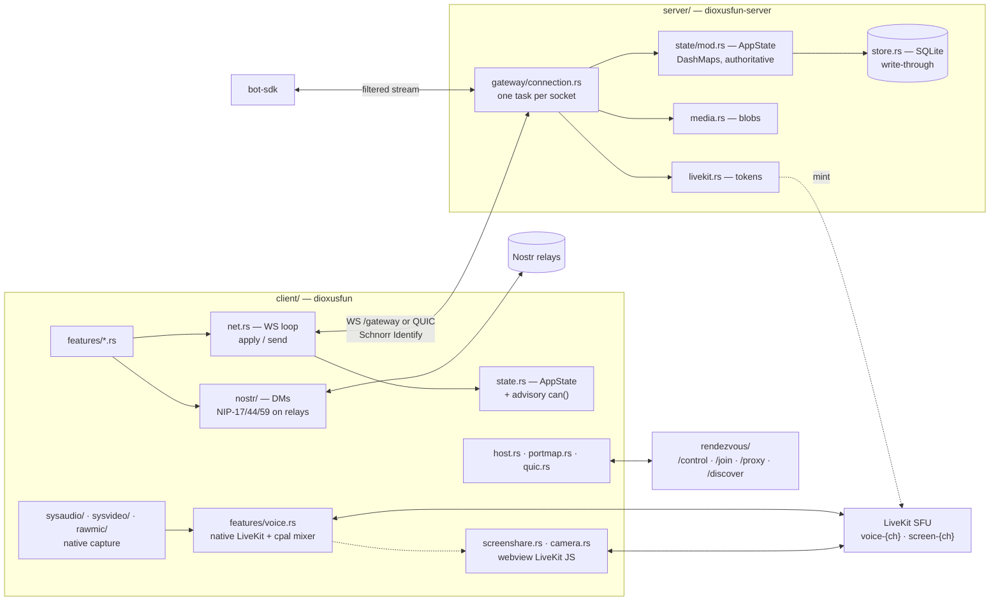

# Map

Where things are, so a reader greps once instead of three times. `CLAUDE.md`
carries what every session needs — the rules and the invariants; this carries
what only some do: where to open, what moves together, how the parts connect. It exists because a handful of files hold most of the tree,
and reading one whole to find one arm is the usual waste.

Symbols, never line numbers: a symbol can be grepped and a number cannot, and
a number is wrong as soon as two branches disagree — which is how the first
version of this file shipped three of them stale.

## Read whole vs grep

| Size | Files | How |
|---|---|---|
| < 300 | most of `client/src/nostr/*`, `client/src/{identity,session,settings,version,quic,portmap}.rs`, `protocol/src/rendezvous.rs` | read whole |
| 300–800 | `client/src/{state,app}.rs`, `client/src/features/{home,connect,guilds,workspace}.rs`, `server/src/{http,auth}.rs` | grep to a symbol, then read the block |
| > 900 | `client/src/features/{voice,channels,screenshare,chat}.rs`, `client/src/{net,update}.rs`, `server/src/{state/mod,gateway/connection,store}.rs`, `protocol/src/lib.rs` | **never read whole** — grep the variant or `fn` name |

Bands, not a list of sizes: a number goes stale on the next commit, a band
survives. Re-derive with `wc -l` if a file feels miscategorised — eleven are
over 800 today.

## Entry points

| To find | Open | At |
|---|---|---|
| What a `ServerMessage` does to the client | `client/src/net.rs` | `fn apply` — one arm per variant, exhaustive |
| What the server does with a `ClientMessage` | `server/src/gateway/connection.rs` | `handle_connection`, then ~50 `ClientMessage::` arms |
| Every wire type | `protocol/src/lib.rs` | grep the variant name; ~70 of them |
| Server state mutation + permissions | `server/src/state/mod.rs` | methods on `AppState`; all async, all write through `persist(…)` |
| Client state + advisory `can()` | `client/src/state.rs` | `AppState`, `use_app_state`, `use_gateway` |
| DMs end to end | `client/src/nostr/service.rs` | `spawn_nostr`; `conversation_id` is the Uuid derivation |
| Voice, capture, mixing | `client/src/features/voice.rs` | the largest file in the tree — grep `ScreenAudioRoom`, `ScreenVideoRoom`, `forward_mic` |
| The first screen | `client/src/features/home.rs` | `HomeView`; the connect form is `connect::ConnectForm` |

## Change recipes

Ordered file lists. Trap 1 in `CLAUDE.md` is the protocol one and is not
repeated here.

| Task | Touch, in order |
|---|---|
| New UI surface | `client/src/features/<new>.rs` → `client/src/features/mod.rs` → mount in `features/workspace.rs` (in a session) or `features/home.rs` (before one) |
| New Tailwind class | write it → `dx build --package dioxusfun` → commit `client/assets/tailwind.css` (trap 13) |
| New Nostr event kind | `client/src/nostr/<kind>.rs` → `client/src/nostr/mod.rs` → subscribe/handle in `nostr/service.rs` → new field in `client/src/state.rs` |
| New server permission | `protocol/src/lib.rs` (`Permission`) → `server/src/state/mod.rs` (`can`) → the handler arm in `gateway/connection.rs` → `client/src/state.rs` `can()` for hiding UI |
| A name shown anywhere | never store it — `AppState::display_name` (trap 8) |
| Deferred work | `docs/OPEN.md`, never only a commit message |

## Tests

| Kind | Where | Note |
|---|---|---|
| Wire, end to end | `server/tests/*.rs` | spawn a real gateway, drive it through the bot SDK; copy a helper block |
| Partial failure | `server/tests/voice.rs` | `ScriptedMinter` answers per request — the delegation seam doubles as a fault injector |
| Platform paths | `client/tests/live_sfu.rs`, `#[ignore]`d unit tests | need an SFU, an audio device or a screen grant — hence ignored, not optional |
| Everything else | beside the code | the suite stays headless and green |

## Architecture

## Not in this repo

Messages in memory (DB only, trap 2) · a browser client (P3) · cluster mode
(P7) · issue tracker (`docs/OPEN.md` is it).
