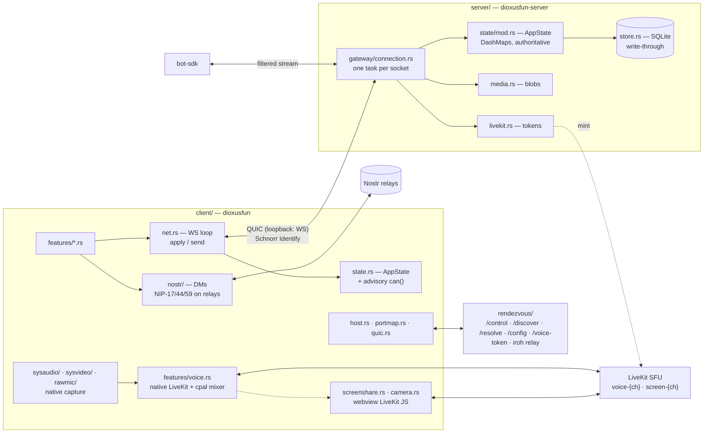

# Map

Where things are, so a reader greps once instead of three times. `CLAUDE.md`
carries what every session needs — the rules and the invariants; this carries
what only some do: where to open, what moves together, how the parts connect. It exists because a handful of files hold most of the tree,
and reading one whole to find one arm is the usual waste.

Symbols, never line numbers, and no hand-kept list that a commit can falsify:
a symbol can be grepped and a number cannot, and this file shipped three stale
numbers and seven miscategorised files before that rule was learned.

## Do not read these whole

15 files hold most of the tree. Opening one to find a single arm costs more
than every other document here put together, so grep the variant or the `fn`
name instead.

| File | Lines |
|---|---|
| `client/src/features/voice.rs` | 3065 |
| `server/src/state/mod.rs` | 2983 |
| `server/tests/owner_controls.rs` | 3036 |
| `server/src/gateway/connection.rs` | 2790 |
| `client/src/features/channels.rs` | 1822 |
| `client/src/features/screenshare.rs` | 1639 |
| `protocol/src/lib.rs` | 2500 |
| `client/src/state.rs` | 1832 |
| `client/src/update.rs` | 1226 |
| `client/src/net.rs` | 1374 |
| `client/src/features/chat.rs` | 1057 |
| `server/src/store.rs` | 1041 |
| `client/src/features/guild_settings.rs` | 1138 |
| `client/src/identity.rs` | 1029 |
| `client/src/features/discord_import.rs` | 1127 |

Everything else is small enough that `wc -l` answers faster than a list here
could stay true. There used to be rows for "under 300" and "300 to 800": they
were wrong about seven files across three review rounds, and being wrong in
that direction says a file is safe to open when it is not.

## Entry points

| To find | Open | At |
|---|---|---|
| What a `ServerMessage` does to the client | `client/src/net.rs` | `fn apply` — one arm per variant, exhaustive |
| What the server does with a `ClientMessage` | `server/src/gateway/connection.rs` | `handle_connection`, then ~50 `ClientMessage::` arms |
| Every wire type | `protocol/src/lib.rs` | grep the variant name; ~70 of them |
| Server state mutation + permissions | `server/src/state/mod.rs` | methods on `AppState`; all async, all write through `persist(…)` |
| Client state + advisory `can()` | `client/src/state.rs` | `AppState`, `use_app_state`, `use_gateway` |
| DMs end to end | `client/src/nostr/service.rs` | `spawn_nostr`; `conversation_id` is the Uuid derivation |
| Voice, capture, mixing | `client/src/features/voice.rs` | the largest file in the tree — grep `ScreenAudioRoom`, `ScreenVideoRoom`, `forward_mic` |
| The first screen | `client/src/features/home.rs` | `HomeView`; the connect form is `connect::ConnectForm` |
| Public servers on a globe | `client/src/features/globe.rs` | `Globe` — a canvas driven by `assets/globe.js` (dots, drag, pins, the land mask); `connect::BrowseTab` feeds it `/discover`, and the Create tab reuses it in `pick` mode to place a host's own pin, pre-placed by `tzgeo::guess` from the machine's timezone |
| Experience, and the two numbers it makes | `server/src/state/mod.rs` | `award_xp` — amount, cooldown, channels and rank names all come from the guild's `Leveling`. The cross-server sum is the client's: `client/src/xp_ledger.rs` adds it up, `nostr/xp.rs` signs and paces it (`Publisher`), `features/leveling.rs` joins the two |
| What a guild calls its ranks, and who may say | `client/src/features/guild_leveling.rs` | `LevelingEditor` — the draft is the settings dialog's, so it saves with everything else |
| What someone is playing, and who says so | `client/src/presence/mod.rs` | `PresenceService` merges the two producers; `detect.rs` walks the process table, `ipc.rs` speaks Discord's local RPC frames |
| Guild settings, and what its one Save writes | `client/src/features/guild_settings.rs` | `GuildSettingsDialog` — every field is a draft signal; `save_all` sends only the messages whose values moved. `GuildTab` only chooses which drafts are on screen, so one Save covers every tab. Tabs follow permissions: the guild menu's Roles entry opens it on `GuildTab::Roles` (`roles::RolesEditor`, which saves per role) for someone with Manage roles alone. The member-list order is a `Leveling` field but is chosen on the Roles tab and saves at once; `AppState::members_of` sorts by it and `members::group_by_top_role` draws a heading per role. A role's `position` only orders display — `ReorderRoles` grants nothing |
| The settings dialog | `client/src/features/settings_dialog.rs` | `SETTINGS_TABS` + `SettingsTab`. Mounted at the *workspace root*, never inside a grid panel — a raised panel carries a `z-index`, and that traps `position: fixed` children (trap 22). `AppState::audio_settings` opens it |
| Where this session's data goes | `client/src/features/topology.rs` | `TopologyDialog` — per-leg, per-session; opened from the transport chip |
| Panel arrangements | `client/src/features/workspace.rs` | `LAYOUT_TEMPLATES` + `LayoutButton`; `persist_layout` writes both the cell and free snapshots |
| Keys on this machine | `client/src/identity.rs` | `detected` / `sign_in` / `forget`; one file per key under `identities_dir()` (default `config_dir()/identities/`, `identities-dir` overrides), `identity.json` names the active one |
| Keys at rest | `client/src/keyvault.rs` | NIP-49 `ncryptsec` under a random passphrase; `backend()` picks keychain or `vault.key` once and `vault.backend` remembers (trap 23) |
| Choosing the keys folder | `client/src/features/identity_setup.rs` | `FolderSettings` — the cog on the setup screen; `DetectedIdentities` rescans on every render, `rev` forces one |
| Bringing a Discord server over | `client/src/features/discord_import.rs` | `read_plan` fetches with a bot token, `flatten_channels`/`plan_roles` map, `run_import` replays `CreateGuild`→`SetGuildProfile`→`CreateChannel`→`CreateRole`→`CreateGuildEmoji` one write per 450 ms; opened from the rail via `GuildDialog::ImportDiscord` |
| A device that stays busy after voice | `client/src/features/voice.rs` | `pick_device`, and the `Drop` impls of `MicCapture` / `PlaybackMixer` (trap 24); `client/src/audio_diag.rs` prints CoreAudio's view in debug builds |
| Bisecting audio without the app | `client/examples/bt_probe.rs` | `cpal`, `livekit`, `room` modes; `room` spawns the bundled LiveKit on loopback |
| Which accent wins, and where | `client/src/features/workspace.rs` | `guild_accent_to_apply` — the guild's is written on a descendant of the app root, so it beats the personal one unless it is not written at all |
| The soundboard | `client/src/features/soundboard.rs` | `SoundboardPopover` plays (a non-blocking popover; `DISMISS_JS` closes it on an outside click or Escape; a right-click, or `soundboard_adjusting`, swaps the sounds for the volume slider), `SoundSettings` uploads (Manage guild only). A play is decoded by `sound_decode.rs` (symphonia; Opus, which Discord serves, through `opus-rs`), sent as `VoiceCmd::PlaySound` to `soundboard_loop` in `voice.rs`, which publishes a track named `soundboard`; listeners find it with `TrackKind::of` and give it `soundboard_pct`. The gateway only stores the library and relays `SoundPlayed` |
| Who sees a voice channel | `server/src/state/mod.rs` | `can_see_channel`; the gateway's `send_voice_state`, `viewers_of`, `voice_sight` and `apply_sight_change` carry it out (trap 30). Configured in `client/src/features/channel_access.rs`, opened from the channel menu |
| Taking someone out of a call | `server/src/gateway/connection.rs` | `DisconnectVoice` (Disconnect from voice permission); every exit calls `evict_from_call` → `livekit::evict`, proven against a real SFU by `client/tests/live_sfu.rs` |
| Where a self-host's calls go, and what outlives a rendezvous restart | `client/src/host.rs` | `sfu_plan` — bundled unless friends cannot reach the media ports; `rendezvous::maintain` re-registers and refreshes the grant, `net::apply_host_update` shows it in the banner |
| A bot's buttons | `server/src/state/commands.rs` | `invoke_command` — every check a press passes before the bot sees it; `protocol::validate_commands` and `check_args` hold the declaration and the args, and the client form runs the same `check_args`. Drawn by `features/bot_commands.rs`: `BotCommandsSection` on the profile card, `CommandNotes` for private replies under the chat |
| A socket that went quiet | `server/src/watchdog.rs` | `ArmWatch` — both socket loops name the branch they are in; `loop step still running` in the log names the arm that never returned, `gateway send dropped` a client loop that is gone |
| Leaving a server, and stopping an embedded one | `client/src/features/workspace.rs` | `Leaving` + `leave`; the teardown effect runs before `on_disconnect` (trap 17) |

## Change recipes

Ordered file lists. Trap 1 in `CLAUDE.md` is the protocol one and is not
repeated here.

| Task | Touch, in order |
|---|---|
| New UI surface | `client/src/features/<new>.rs` → `client/src/features/mod.rs` → mount in `features/workspace.rs` (in a session) or `features/home.rs` (before one) |
| New Tailwind class | write it → `dx build --package dioxusfun` → commit `client/assets/tailwind.css` (trap 13) |
| New Nostr event kind | `client/src/nostr/<kind>.rs` → `client/src/nostr/mod.rs` → subscribe/handle in `nostr/service.rs` → new field in `client/src/state.rs` |
| New server permission | `protocol/src/lib.rs` (`Permission`) → `server/src/state/mod.rs` (`can`) → the handler arm in `gateway/connection.rs` → `client/src/state.rs` `can()` for hiding UI |
| A name shown anywhere | never store it — `AppState::display_name` (trap 8) |
| A new free-text or name field | cap and filter it in the gateway arm, then mirror the cap in `server/src/sanitize.rs`, which is what an import or a legacy row gets instead |
| A new `Guild` field | `protocol` → a column and an `ALTER TABLE` in `store.rs` (schema *and* migration list, load, upsert) → `sanitize::guild` → the `Guild { .. }` literals in `state/mod.rs` and `server/tests/{retention,archive}.rs` |
| A new `Channel` field | `protocol` (`#[serde(default)]`) → a column and an `ALTER TABLE` in `store.rs` (migration list, load, upsert) → `sanitize::channel` → the `Channel { .. }` literals in `state/mod.rs`, `server/tests/{retention,archive}.rs` and the client tests |
| A new *ephemeral* field | cap it in the gateway arm only — `sanitize.rs` is for rows that come back from disk, and this kind never goes there (trap 19) |
| Deferred work | a GitHub issue, never only a commit message |

## Tests

| Kind | Where | Note |
|---|---|---|
| Wire, end to end | `server/tests/*.rs` | spawn a real gateway, drive it through the bot SDK; copy a helper block |
| Partial failure | `server/tests/voice.rs` | `ScriptedMinter` answers per request — the delegation seam doubles as a fault injector |
| Platform paths | `client/tests/live_sfu.rs`, `#[ignore]`d unit tests | need an SFU, an audio device or a screen grant — hence ignored, not optional |
| Everything else | beside the code | the suite stays headless and green |

## Architecture

```mermaid
flowchart LR
  subgraph C["client/ — dioxusfun"]
    UI["features/*.rs"]
    NET["net.rs — WS loop<br/>apply / send"]
    ST["state.rs — AppState<br/>+ advisory can()"]
    NOSTR["nostr/ — DMs<br/>NIP-17/44/59 on relays"]
    V["features/voice.rs<br/>native LiveKit + cpal mixer"]
    CAP["sysaudio/ · sysvideo/ · rawmic/<br/>native capture"]
    JS["screenshare.rs · camera.rs<br/>webview LiveKit JS"]
    HOST["host.rs · portmap.rs · quic.rs"]
    UI-->NET-->ST
    UI-->NOSTR
    CAP-->V
    V-.->JS
  end
  subgraph S["server/ — dioxusfun-server"]
    GW["gateway/connection.rs<br/>one task per socket"]
    AS["state/mod.rs — AppState<br/>DashMaps, authoritative"]
    DB[("store.rs — SQLite<br/>write-through")]
    MED["media.rs — blobs"]
    LK["livekit.rs — tokens"]
    GW-->AS-->DB
    GW-->MED
    GW-->LK
  end
  SFU["LiveKit SFU<br/>voice-{ch} · screen-{ch}"]
  RZ["rendezvous/<br/>/control · /discover · /resolve · /config · /voice-token · iroh relay"]
  RELAYS[("Nostr relays")]
  BOT["bot-sdk"]
  NET<-->|"QUIC (loopback: WS)<br/>Schnorr Identify"|GW
  BOT<-->|filtered stream|GW
  V<-->SFU
  JS<-->SFU
  LK-.mint.->SFU
  HOST<-->RZ
  NOSTR<-->RELAYS
```

## Not in this repo

Messages in memory (DB only, trap 2) · a browser client (P3) · cluster mode
(P7) · issue tracker (GitHub issues).
