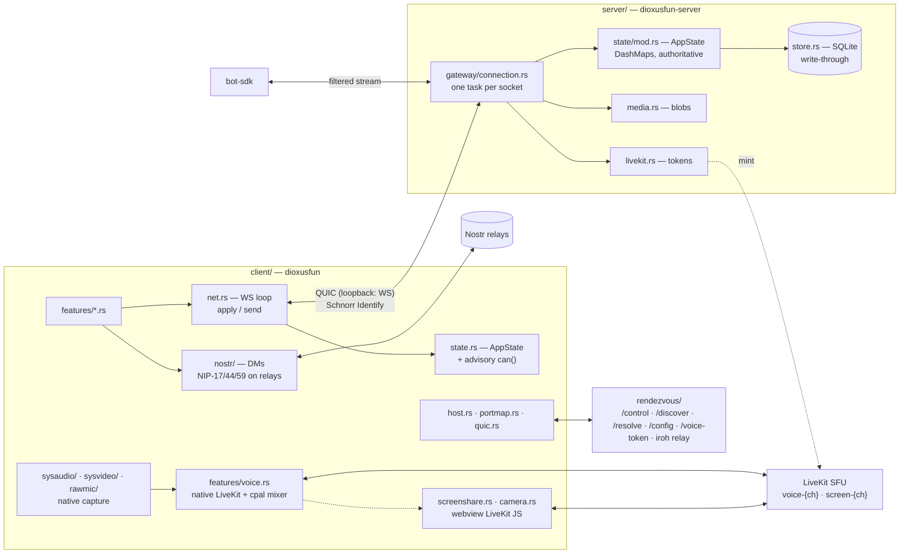

# Map

Where things are, so a reader greps once instead of three times. `CLAUDE.md`
carries what every session needs — the rules and the invariants; this carries
what only some do: where to open, what moves together, how the parts connect. It exists because a handful of files hold most of the tree,
and reading one whole to find one arm is the usual waste.

Symbols, never line numbers, and no hand-kept list that a commit can falsify:
a symbol can be grepped and a number cannot, and this file shipped three stale
numbers and seven miscategorised files before that rule was learned.

## Do not read these whole

15 files hold most of the tree. Opening one to find a single arm costs more
than every other document here put together, so grep the variant or the `fn`
name instead.

| File | Lines |
|---|---|
| `client/src/features/voice.rs` | 4040 |
| `server/src/state/mod.rs` | 2983 |
| `server/tests/owner_controls.rs` | 3036 |
| `server/src/gateway/connection.rs` | 2808 |
| `client/src/features/channels.rs` | 1969 |
| `client/src/features/screenshare.rs` | 2778 |
| `protocol/src/lib.rs` | 2514 |
| `client/src/state.rs` | 1922 |
| `client/src/update.rs` | 1226 |
| `client/src/net.rs` | 1460 |
| `client/src/features/chat.rs` | 1158 |
| `server/src/store.rs` | 1041 |
| `client/src/features/guild_settings.rs` | 1132 |
| `client/src/identity.rs` | 1029 |
| `client/src/features/discord_import.rs` | 1127 |

Everything else is small enough that `wc -l` answers faster than a list here
could stay true. There used to be rows for "under 300" and "300 to 800": they
were wrong about seven files across three review rounds, and being wrong in
that direction says a file is safe to open when it is not.

## Entry points

| To find | Open | At |
|---|---|---|
| What a `ServerMessage` does to the client | `client/src/net.rs` | `fn apply` — one arm per variant, exhaustive |
| What the server does with a `ClientMessage` | `server/src/gateway/connection.rs` | `handle_connection`, then ~50 `ClientMessage::` arms |
| Every wire type | `protocol/src/lib.rs` | grep the variant name; ~70 of them |
| Server state mutation + permissions | `server/src/state/mod.rs` | methods on `AppState`; all async, all write through `persist(…)` |
| Client state + advisory `can()` | `client/src/state.rs` | `AppState`, `use_app_state`, `use_gateway` |
| DMs end to end | `client/src/nostr/service.rs` | `spawn_nostr`; `conversation_id` is the Uuid derivation |
| Voice, capture, mixing | `client/src/features/voice.rs` | the largest file in the tree — grep `ScreenAudioRoom`, `NativeVideoRoom`, `ScreenVideoRoom`, `forward_mic` |
| The first screen | `client/src/features/home.rs` | `HomeView`; the connect form is `connect::ConnectForm` |
| Public servers on a globe | `client/src/features/globe.rs` | `Globe` — `globe_geometry.rs` generates land dots from `assets/globe-land.bin` and converts geographic coordinates; `assets/globe.js` draws Canvas on demand, animating only for motion/pulses, suspending while hidden and releasing observers/listeners on destroy; `connect::BrowseTab` feeds it `/discover`, and the Create tab reuses it in `pick` mode to place a host's own pin, pre-placed by `tzgeo::guess` from the machine's timezone |
| Experience, and the two numbers it makes | `server/src/state/mod.rs` | `award_xp` — amount, cooldown, channels and rank names all come from the guild's `Leveling`. The cross-server sum is the client's: `client/src/xp_ledger.rs` adds it up, `nostr/xp.rs` signs and paces it (`Publisher`), `features/leveling.rs` joins the two |
| What a guild calls its ranks, and who may say | `client/src/features/guild_leveling.rs` | `LevelingEditor` — the draft is the settings dialog's, so it saves with everything else |
| What someone is playing, and who says so | `client/src/presence/mod.rs` | `PresenceService` owns RPC tasks and `ScanWorker`; `detect.rs` scans every 15 s and observes custom-game edits without restarting. `installed.rs` caches Steam manifests (all platforms), Epic manifests and Ubisoft registry entries (Windows), refreshing every 5 min; helpers/tools are excluded. `ipc.rs::listen` owns connected games. Session teardown cancels listeners and wakes the scanner |
| Registering additional games | `client/src/features/settings_dialog.rs` | Activity tab shows the published activity and `GameDetectionOverrides`; executable/name pairs persist in `detect_extra`, override the fallback catalogue and update an enabled detector on its next scan |
| Guild settings, and what its one Save writes | `client/src/features/guild_settings.rs` | `GuildSettingsDialog` — every field is a draft signal; `save_all` sends only the messages whose values moved. `GuildTab` only chooses which drafts are on screen, so one Save covers every tab. Tabs follow permissions: the guild menu's Roles entry opens it on `GuildTab::Roles` (`roles::RolesEditor`, which saves per role) for someone with Manage roles alone. The member-list order is a `Leveling` field but is chosen on the Roles tab and saves at once; `AppState::members_of` sorts by it and `members::group_by_top_role` draws a heading per role. A role's `position` only orders display — `ReorderRoles` grants nothing |
| The settings dialog | `client/src/features/settings_dialog.rs` | `SETTINGS_TABS` + `SettingsTab`. Mounted at the *workspace root*, never inside a grid panel — a raised panel carries a `z-index`, and that traps `position: fixed` children (trap 22). `AppState::audio_settings` opens it |
| Where this session's data goes | `client/src/features/topology.rs` | `TopologyDialog` — per-leg, per-session; opened from the transport chip |
| Panel arrangements | `client/src/features/workspace.rs` | `LAYOUT_TEMPLATES` + `LayoutButton`; `persist_layout` writes both the cell and free snapshots |
| Panel drag rendering | `grid-layout/src/item.rs`, `grid-layout/src/grid.rs` | `GridItem` derives snap-mode transforms/z-order through a Rust memo; pointer moves update `Interaction`, and commit/cancel clears it. Free positioning, snapping and resize retain their Rust layout policy; no JavaScript style mutations |
| Watching several screen shares | `client/src/features/screenshare.rs`, `client/src/features/stream_viewer.rs` | `ScreenWatchWindow` keeps keyed attachments while switching between floating panels and a viewport-sized mosaic. `stream_tile_style` resets all inline layout properties in every mode because Dioxus retains omitted properties; the drag layer stays above every tile. `use_stream_drag` cancels on release, focus loss, cursor exit and Escape. `grid_style` maximizes 16:9 video area. `use_popouts` opens one native desktop window for detached screens, with focus, volume, pinning and full screen; closing it docks the streams. Watch channels synchronize state and keys across independent VirtualDOMs; generation-tagged commands reject old windows. `#viewer` is subscribe-only; the main window retains audio and unsubscribes detached video. Legacy servers leave in-app viewing available |
| Selecting a screen share | `client/src/features/screenshare.rs` | `ScreenSourcePicker` mounts `ScreenShareDialog`; `ScreenSourceTile` loads an in-memory PNG through `sysvideo::thumbnail`, at most two native captures at once, refreshed on request. Source, resolution, FPS and audio are drafts until Share. `ScreenSelfPreview` uses native focus/visibility/minimize events with a cancellable one-second Rust debounce before changing its own preview subscription; brief focus switches avoid keyframe churn, while stop/identity changes clean up immediately without stopping publication. `sysvideo/windows.rs` uses Windows Graphics Capture without borders where supported, `sysvideo/macos.rs` ScreenCaptureKit; `selected_capture_settings` feeds the native LiveKit publisher |
| Cropping avatars and banners | `client/src/image_edit.rs`, `client/src/features/image_editor.rs` | Native PNG/JPEG/GIF/WebP decoding, EXIF orientation, bounded PNG preview and crop/export run through `spawn_blocking`; the WebView draws the preview and drag/zoom controls. Avatars preserve PNG alpha; JPEG banners flatten on white. Invalid input stays in the editor with an error |
| Copying keys and invites | `client/src/clipboard.rs` | `copy_text` writes to the native system clipboard through arboard; a thread-local owner keeps X11 contents available. Copy buttons report success only after the native write succeeds |
| Attaching chat images | `client/src/chat_image.rs`, `client/src/features/chat.rs` | Native clipboard RGBA becomes bounded PNG; Dioxus drop/file-picker events provide paths for bounded Rust reads and content validation. Workers prepare data URLs under the 2 MB upload cap; keyed composers and request generations discard stale loads. The WebView only signals image paste and displays previews |
| Notification and UI sounds | `client/src/native_sounds.rs`, `client/src/features/sounds.rs` | Rust synthesizes/caches all 15 tones; a bounded worker owns CPAL output on the selected device, mixes overlapping sounds and closes/pauses after 1.5 s idle. `MessageSounds` tracks DM/channel ticks and volume/output settings on home and workspace; audio callbacks neither allocate nor block |
| Camera capture and publication | `client/src/syscamera.rs`, `client/src/features/voice_camera.rs`, `client/src/features/camera.rs` | Windows camera enumeration/capture uses WebRTC through a small C++ bridge; Rust owns the COM worker, validated I420 copies, first-frame/stall checks and publication. `NativeVideoRoom` shares `#video` with the screen, stopping tracks independently; the WebView renders previews/viewers. macOS/Linux retain browser camera capture |
| Keys on this machine | `client/src/identity.rs` | `detected` / `sign_in` / `forget`; one file per key under `identities_dir()` (default `config_dir()/identities/`, `identities-dir` overrides), `identity.json` names the active one |
| Keys at rest | `client/src/keyvault.rs` | NIP-49 `ncryptsec` under a random passphrase; `backend()` picks keychain or `vault.key` once and `vault.backend` remembers (trap 23) |
| Choosing the keys folder | `client/src/features/identity_setup.rs` | `FolderSettings` — the cog on the setup screen; `DetectedIdentities` rescans on every render, `rev` forces one |
| Bringing a Discord server over | `client/src/features/discord_import.rs` | `read_plan` fetches with a bot token, `flatten_channels`/`plan_roles` map, `run_import` replays `CreateGuild`→`SetGuildProfile`→`CreateChannel`→`CreateRole`→`CreateGuildEmoji` one write per 450 ms; opened from the rail via `GuildDialog::ImportDiscord` |
| A device that stays busy after voice | `client/src/features/voice.rs` | `pick_device`, and the `Drop` impls of `MicCapture` / `PlaybackMixer` (trap 24); `client/src/audio_diag.rs` prints CoreAudio's view in debug builds |
| Capture audio queues | `client/src/audio_queue.rs`, `client/src/sysaudio/frames.rs`, `client/src/features/voice.rs` | Mic/DSP and system-audio publication use fixed 480-sample blocks, eight-frame bounded queues and nonblocking offers; blocks older than 100 ms are discarded before DSP/publication. `FrameCutter` reuses a fixed partial block and counts dropped blocks for the Windows silence clock. SDK/network buffers are separate |
| Bundled voice server size and integrity | `server/build.rs`, `server/src/livekit_bundle.rs` | Build compresses the SFU as gzip and emits original size/full SHA-256. `ensure_binary` reuses a verified cached executable or streams bounded decompression into a temporary file, checking size/hash before rename, inside `spawn_blocking`. `LIVEKIT_BUNDLE_SKIP` remains an empty bundle |
| Bisecting audio without the app | `client/examples/bt_probe.rs` | `cpal`, `livekit`, `room` modes; `room` spawns the bundled LiveKit on loopback |
| Which accent wins, and where | `client/src/features/workspace.rs` | `guild_accent_to_apply` — the guild's is written on a descendant of the app root, so it beats the personal one unless it is not written at all |
| Native dice activity | `client/src/features/activities.rs` | `DicePanel` — Rust RNG, Dioxus state and async animation timers; sharing stays bound to the launch channel and reports a closed gateway. No iframe or JavaScript RPC |
| Chat scroll policy | `client/src/features/chat_scroll.rs`, `client/src/features/chat.rs` | `MessagePage` virtualizes 50-row pages, retaining measured heights outside a 1200 px viewport margin; `ChatView` borrows history and clones only mounted rows. `ScrollState` decides following and row anchors in Rust; `SCROLL_JS` measures pages/reflow through ResizeObserver and rejects stale sequences, channels and replaced nodes |
| The soundboard | `client/src/features/soundboard.rs` | `SoundboardPopover` plays (a non-blocking popover; Rust pointer/key events in `WorkspaceView` close it on an outside click or Escape; the popover and toggle stop pointer propagation; a right-click, or `soundboard_adjusting`, swaps the sounds for the volume slider), `SoundSettings` uploads (Manage guild only). A play is decoded by `sound_decode.rs` (symphonia; Opus, which Discord serves, through `opus-rs`), sent as `VoiceCmd::PlaySound` to `soundboard_loop` in `voice.rs`, which publishes a track named `soundboard`; listeners find it with `TrackKind::of` and give it `soundboard_pct`. The gateway only stores the library and relays `SoundPlayed` |
| Who sees a voice channel | `server/src/state/mod.rs` | `can_see_channel`; the gateway's `send_voice_state`, `viewers_of`, `voice_sight` and `apply_sight_change` carry it out (trap 30). Configured in `client/src/features/channel_access.rs`, opened from the channel menu |
| Taking someone out of a call | `server/src/gateway/connection.rs` | `DisconnectVoice` (Disconnect from voice permission); every exit calls `evict_from_call` → `livekit::evict`, proven against a real SFU by `client/tests/live_sfu.rs` |
| Where a self-host's calls go, and what outlives a rendezvous restart | `client/src/host.rs` | `sfu_plan` — bundled unless friends cannot reach the media ports; `rendezvous::maintain` re-registers and refreshes the grant, `net::apply_host_update` shows it in the banner |
| Published name ownership | `rendezvous/src/registry.rs`, `rendezvous/tests/handshake.rs` | `claim_host` reserves the name and session under one lock, including quotas and persistence. Hex key casing does not change ownership; disconnect clears the session/grants, while the signed owner keeps its reservation until `release_name`. Reopen and concurrent claims are tested. |
| A bot's buttons | `server/src/state/commands.rs` | `invoke_command` — every check a press passes before the bot sees it; `protocol::validate_commands` and `check_args` hold the declaration and the args, and the client form runs the same `check_args`. Drawn by `features/bot_commands.rs`: `BotCommandsSection` on the profile card, `CommandNotes` for private replies under the chat |
| Closing a secondary session | `server/src/gateway/connection.rs`, `server/tests/voice.rs` | `handle_connection` preserves voice/share while another identified socket remains; the last socket still clears voice and evicts SFU identities |
| A socket that went quiet | `server/src/watchdog.rs` | `ArmWatch` — both socket loops name the branch they are in; `loop step still running` in the log names the arm that never returned, `gateway send dropped` a client loop that is gone |
| Leaving a server, quitting, and stopping an embedded one | `client/src/app.rs`, `client/src/features/workspace.rs`, `client/src/net.rs` | `QuitRequest` routes application exit through `Leaving`; notify `LeaveVoice`, close media, then await the bounded WebSocket/QUIC shutdown before `on_disconnect` and window destruction. Windows tray hiding preserves the session (trap 17) |

## Change recipes

Ordered file lists. Trap 1 in `CLAUDE.md` is the protocol one and is not
repeated here.

| Task | Touch, in order |
|---|---|
| New UI surface | `client/src/features/<new>.rs` → `client/src/features/mod.rs` → mount in `features/workspace.rs` (in a session) or `features/home.rs` (before one) |
| New Tailwind class | write it → `dx build --package dioxusfun` → commit `client/assets/tailwind.css` (trap 13) |
| New Nostr event kind | `client/src/nostr/<kind>.rs` → `client/src/nostr/mod.rs` → subscribe/handle in `nostr/service.rs` → new field in `client/src/state.rs` |
| New server permission | `protocol/src/lib.rs` (`Permission`) → `server/src/state/mod.rs` (`can`) → the handler arm in `gateway/connection.rs` → `client/src/state.rs` `can()` for hiding UI |
| A name shown anywhere | never store it — `AppState::display_name` (trap 8) |
| A new free-text or name field | cap and filter it in the gateway arm, then mirror the cap in `server/src/sanitize.rs`, which is what an import or a legacy row gets instead |
| A new `Guild` field | `protocol` → a column and an `ALTER TABLE` in `store.rs` (schema *and* migration list, load, upsert) → `sanitize::guild` → the `Guild { .. }` literals in `state/mod.rs` and `server/tests/{retention,archive}.rs` |
| A new `Channel` field | `protocol` (`#[serde(default)]`) → a column and an `ALTER TABLE` in `store.rs` (migration list, load, upsert) → `sanitize::channel` → the `Channel { .. }` literals in `state/mod.rs`, `server/tests/{retention,archive}.rs` and the client tests |
| A new *ephemeral* field | cap it in the gateway arm only — `sanitize.rs` is for rows that come back from disk, and this kind never goes there (trap 19) |
| Deferred work | a GitHub issue, never only a commit message |

## Tests

| Kind | Where | Note |
|---|---|---|
| Wire, end to end | `server/tests/*.rs` | spawn a real gateway, drive it through the bot SDK; copy a helper block |
| Partial failure | `server/tests/voice.rs` | `ScriptedMinter` answers per request — the delegation seam doubles as a fault injector |
| Platform paths | `client/tests/live_sfu.rs`, `#[ignore]`d unit tests | need an SFU, an audio device or a screen grant — hence ignored, not optional |
| Windows native screen capture | `client/src/sysvideo/windows.rs` | ignored `selected_windows_and_monitors_feed_livekit_and_stop` needs an interactive desktop; validates selected sources, video handoff, dimensions and teardown |
| A received screen share at half size and 3 FPS | `client/src/features/voice.rs` | `screen_video_options` disables native simulcast; LiveKit's default lower screen-share layer halves the dimensions and caps FPS at 3, which adaptive viewers can select |
| Native screen-share FPS | `client/src/sysvideo/windows.rs`, `client/src/features/voice.rs`, `client/src/features/screenshare.rs` | `FramePacer` keeps deadlines across callback jitter; `ScreenVideoRoom` samples per-capture `metrics::Metrics` and encoder stats once per second; capture size/FPS, processing ms/frame and encoding ms/frame identify separate bottlenecks. Windows debug fields separate source callbacks, pacing skips, largest callback gap, GPU readback and conversion costs; stage/frame totals share one snapshot lock. `ScreenSelfPreview` shows CPU/GPU for known encoder implementations; unreported or unknown implementations remain unclassified. Debug logs identify track SIDs, native keyframes/retransmissions and WebView freezes/NACK/PLI counters; inbound polling discards reports for replaced tracks |
| Release optimization experiment | `Cargo.toml`, `docs/OPS.md` | `release-lto` inherits release with thin LTO and debuginfo stripping; default release is unchanged. Protocol tests pass in both profiles; this comparison is not a full-client size/performance benchmark |
| Native GPU-frame investigation | `docs/VIDEO_PIPELINE.md` | Existing macOS CVPixelBuffer handoff; Windows GPU readback/I420/upload boundaries and SDK/encoder requirements for a texture path |
| Native screen-share quality | `client/src/features/voice.rs`, `client/src/features/screenshare.rs` | `upload_budget` sets adaptive caps by resolution/FPS: 720p 3/5, 1080p 6/10, 1440p 12/20, 4K 30/40 Mbps at 30/60 FPS; 15 FPS retains the 30 FPS detail budget. `screen_video_options` applies saved Automatic/GPU/CPU encoding; GPU requires H.264, hardware and no software fallback. `Settings::priority` preserves motion/detail/balanced tradeoffs. `native_screen_codecs_reach_a_real_decoder` starts a bundled SFU (ignored; `DISCORDIA_TEST_REQUIRE_NVENC=1` verifies hardware); `compare_screen_conversion_cost` compares Windows downscaling paths (ignored) |
| Screen-share startup bitrate | `vendor/livekit/PATCHES.md`, `client/src/features/voice.rs` | Native publishing requests half the encoding cap, bounded to 1–4 Mbps; 1440p30 starts with a 4 Mbps hint while retaining its 12 Mbps adaptive cap. The patched SDK applies the hint to SDP without setting a minimum. The pure policy runs in client unit tests; `DISCORDIA_TEST_LEGACY_START=1` compares the original startup in the real-SFU test |
| Windows NVENC build | `vendor/webrtc-sys/PATCHES.md`, `.github/actions/setup-windows-nvenc/action.yml`, `client/build.rs` | Cargo patches webrtc-sys 0.3.39 locally; CUDA_PATH headers/import library enable NVENC, CUDA is delay-loaded at runtime. Windows CI/release jobs install build dependencies; drivers remain optional in Automatic/CPU mode |
| Client dependency features | `docs/DEPENDENCIES.md`, `vendor/dioxus-desktop/PATCHES.md` | Counts, validation and patch maintenance; Dioxus keeps launch/UI/assets while the app owns logging. Desktop limits image formats and makes developer tools opt-in with `--features devtools`; LiveKit API shares the workspace version, and the WebRTC helper pin belongs to build dependencies. |
| NVENC bitrate adaptation | `vendor/webrtc-sys/src/nvidia/h264_encoder_impl.cpp`, `client/src/features/voice.rs` | `SetRates` budgets reach NVENC through `Reconfigure` before the next frame; successful changes update bitrate, VBV and FPS together. `DISCORDIA_TEST_REQUIRE_NVENC=1 DISCORDIA_TEST_NVENC_RATES=1` enables the real-SFU motion test, which checks sent bitrate follows an increased target and video decodes. Add `DISCORDIA_TEST_NVENC_1440P=1` for 1440p30/12 Mbps over 30 seconds; checks full dimensions, FPS and reaching the cap |
| NVENC quality and codec probes | `vendor/webrtc-sys/src/nvidia/h264_encoder_impl.cpp`, `client/src/features/voice.rs` | P5 low-latency, quarter-resolution multipass and spatial AQ; no B-frames/lookahead, five-frame VBV and requested keyframes retained. The motion test rejects repeated keyframes. `DISCORDIA_TEST_MODERN_CODEC=av1` or `h265` probes negotiated codec and real decoding; `DISCORDIA_TEST_MODERN_NO_E2EE=1` isolates encryption in the test only. Windows AV1 currently decodes without E2EE but not with it; HEVC negotiates VP8 instead. Neither codec is offered in the picker |
| Windows AMD/other hardware encoders | `vendor/webrtc-sys/src/windows/mf_encoder_factory.cpp`, `vendor/webrtc-sys/src/video_encoder_factory.cpp` | Automatic prefers NVENC then hardware-only Media Foundation MFTs; binds the matching D3D11 adapter, handles asynchronous input/output with bounded queues, and falls back to software on failure. Preview identifies the driver encoder. `DISCORDIA_TEST_REQUIRE_MF=1` verifies MFT encoding in the real SFU test |
| Windows screen downscaling | `client/src/sysvideo/windows.rs` | `BgraConverter` reuses full-size I420 scratch storage when downscaling; only the scaled buffer reaches WebRTC. Keeps row stride and source aspect ratio. `resizing_bgra_ignores_row_padding_and_preserves_colors` guards channel order and window size changes |
| Screen-share audio scope | `client/src/sysaudio/mod.rs`, `client/src/sysaudio/windows.rs`, `client/src/sysaudio/macos.rs` | Windows monitor capture excludes the Discordia process tree; window capture includes only its owner process tree and rejects roots overlapping Discordia. Missing/invalid targets fail without system-audio fallback; WASAPI startup runs through `spawn_blocking`. macOS uses the selected ScreenCaptureKit filter with `excludesCurrentProcessAudio`; audio is application-scoped, so sibling windows/tabs may be included. Picker labels explain both scopes |
| Stream audio presence | `client/src/stream_audio.rs`, `client/src/features/voice.rs`, `client/src/features/screenshare.rs` | `Presence` unions voice-room, screen-room and WebView audio independently; clearing one source preserves the others. Native publisher suffixes share the viewer's volume/mute key |
| Screen preview measurements | `client/src/features/screenshare.rs` | `AppHead` installs `SCREEN_JS` once; commands send only arguments. `previewStats` shares recent/in-flight reports with Diagnostics; `ScreenWatchTile` skips minimized/hidden windows and unchanged labels |
| WebView screen statistics | `client/src/features/screen_stats.rs`, `client/src/features/screenshare.rs` | `WebViewStats` computes bitrate, FPS fallback and units from raw browser counters; separate inbound/outbound baselines reset on inactivity, track/report/session changes and invalid samples. Browser FPS takes precedence, including zero; native publisher metrics remain in `voice.rs` |
| WebView video connections | `client/src/features/video_lifecycle.rs`, `client/src/features/screenshare.rs` | Rust owns target changes and cancellable retries (1.5-15 s), deduplicates failures and ignores old attempt generations; encryption setup failures block retries. `SCREEN_JS` executes SDK operations and reports status, protecting replacement rooms from late joins/teardown. SDK internal reconnect and DOM attachment stay in the WebView |
| Client media cache | `client/src/media_cache.rs`, `client/src/net.rs` | `MediaCache` queues misses on lookup, shares payloads across state clones and limits data URLs to 128 MiB/2048 entries using LRU. `Updates::ready` wakes the socket only for demand/completions; its retry tick scans pending requests only. A bounded disk worker loads/stores emoji and sounds without blocking the socket |
| Everything else | beside the code | the suite stays headless and green |
| Screen-share webview lifecycle | `client/tests/screenshare_bridge.cjs` | `node client/tests/screenshare_bridge.cjs`; simultaneous video/audio, independent volume, teardown, native-audio switching and stale track/room events; includes `video_lifecycle_bridge.cjs` for connection failure/cancellation, overlapping teardown and encryption guards |
| Native UI bridges | `client/tests/native_ui_bridges.cjs` | `node client/tests/native_ui_bridges.cjs`; scroll races/remount/cleanup and globe geometry handoff, pending setters and teardown |
| Chat image paste bridge | `client/tests/chat_attachment_bridge.cjs` | `node client/tests/chat_attachment_bridge.cjs`; only image paste in the chat is intercepted, remounts reuse one listener, no image bytes cross the event bridge |

## Architecture

```mermaid
flowchart LR
  subgraph C["client/ — dioxusfun"]
    UI["features/*.rs"]
    NET["net.rs — WS loop<br/>apply / send"]
    ST["state.rs — AppState<br/>+ advisory can()"]
    NOSTR["nostr/ — DMs<br/>NIP-17/44/59 on relays"]
    V["features/voice.rs<br/>native LiveKit + cpal mixer"]
    CAP["sysaudio/ · sysvideo/ · rawmic/<br/>native capture"]
    JS["screenshare.rs · camera.rs<br/>webview LiveKit JS"]
    HOST["host.rs · portmap.rs · quic.rs"]
    UI-->NET-->ST
    UI-->NOSTR
    CAP-->V
    V-.->JS
  end
  subgraph S["server/ — dioxusfun-server"]
    GW["gateway/connection.rs<br/>one task per socket"]
    AS["state/mod.rs — AppState<br/>DashMaps, authoritative"]
    DB[("store.rs — SQLite<br/>write-through")]
    MED["media.rs — blobs"]
    LK["livekit.rs — tokens"]
    GW-->AS-->DB
    GW-->MED
    GW-->LK
  end
  SFU["LiveKit SFU<br/>voice-{ch} · screen-{ch}"]
  RZ["rendezvous/<br/>/control · /discover · /resolve · /config · /voice-token · iroh relay"]
  RELAYS[("Nostr relays")]
  BOT["bot-sdk"]
  NET<-->|"QUIC (loopback: WS)<br/>Schnorr Identify"|GW
  BOT<-->|filtered stream|GW
  V<-->SFU
  JS<-->SFU
  LK-.mint.->SFU
  HOST<-->RZ
  NOSTR<-->RELAYS
```

## Not in this repo

Messages in memory (DB only, trap 2) · a browser client (P3) · cluster mode
(P7) · issue tracker (GitHub issues).
