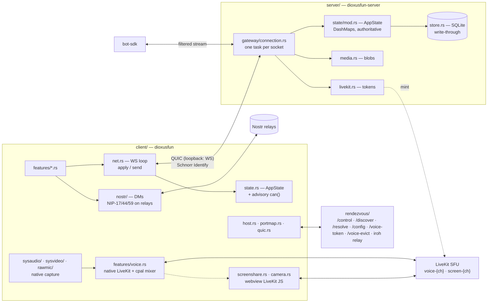

# Map

Where things are, so a reader greps once instead of three times. `CLAUDE.md`
carries what every session needs — the rules and the invariants; this carries
what only some do: where to open, what moves together, how the parts connect. It exists because a handful of files hold most of the tree,
and reading one whole to find one arm is the usual waste.

Symbols, never line numbers, and no hand-kept list that a commit can falsify:
a symbol can be grepped and a number cannot, and this file shipped three stale
numbers and seven miscategorised files before that rule was learned.

## Do not read these whole

15 files hold most of the tree. Opening one to find a single arm costs more
than every other document here put together, so grep the variant or the `fn`
name instead.

| File | Lines |
|---|---|
| `client/src/features/voice.rs` | 4738 |
| `server/src/state/mod.rs` | 3182 |
| `server/tests/owner_controls.rs` | 3036 |
| `server/src/gateway/connection.rs` | 2993 |
| `client/src/features/channels.rs` | 1991 |
| `client/src/features/screenshare.rs` | 3150 |
| `protocol/src/lib.rs` | 2657 |
| `client/src/state.rs` | 2129 |
| `client/src/update.rs` | 1228 |
| `client/src/net.rs` | 2014 |
| `client/src/features/chat.rs` | 1227 |
| `server/src/store.rs` | 1201 |
| `client/src/features/guild_settings.rs` | 1132 |
| `client/src/identity.rs` | 1123 |
| `client/src/features/discord_import.rs` | 1127 |

Everything else is small enough that `wc -l` answers faster than a list here
could stay true. There used to be rows for "under 300" and "300 to 800": they
were wrong about seven files across three review rounds, and being wrong in
that direction says a file is safe to open when it is not.

## Entry points

| To find | Open | At |
|---|---|---|
| What a `ServerMessage` does to the client | `client/src/net.rs` | `fn apply` — one arm per variant, exhaustive |
| What the server does with a `ClientMessage` | `server/src/gateway/connection.rs` | `handle_connection`, then ~50 `ClientMessage::` arms |
| Every wire type | `protocol/src/lib.rs` | grep the variant name; ~70 of them |
| Server state mutation + permissions | `server/src/state/mod.rs` | `durable_writes` stages serialized commands; `durable` rejects failed writes before memory changes; Store handles compound transactions |
| Client state + advisory `can()` | `client/src/state.rs` | `AppState`, `use_app_state`, `use_gateway` |
| DMs end to end | `client/src/nostr/service.rs`, `nostr/delivery.rs` | `spawn_nostr`; `Routes` resolves recipient kind 10050 lists; pending encrypted wraps survive restart, retries reuse event ids; relay acceptance is not a read receipt (a check mark, not a line of text); `Senders` keeps one socket per recipient relay for the account |
| Account lifetime | `client/src/features/account.rs` | `AccountView` owns shared state, Nostr and call alerts across Home/server changes; `clear_server_session` removes guild data while preserving DMs, calls and audio preferences. Joining or hosting a server leaves DM calls active; joining guild voice still requires ending the call |
| Private DM voice calls | `client/src/features/dm_call.rs`, `features/voice_direct.rs`, `nostr/calls.rs` | `spawn_service` owns consent, device selection, deadlines and native WebRTC; `voice::direct::Audio` reuses microphone DSP and playback. Call freshness uses the learned sender clock offset bounded to 5 min, with a 60 s future tolerance matching DM clock learning; relay expiration includes skew allowance while the inner TTL stays 60 s. Rejected signals log their reason and clock offset. Separate, expiring NIP-59 call signals never enter chat history or its durable outbox; publication waits for each recipient relay and retries once with the same event ID. Cancelled IDs suppress delayed invitations, including cancellations received during another call. Incoming calls require a contact or existing DM; guild voice and DM calls are mutually exclusive. `dm_call_tests.rs` covers state transitions and actual decoded peer audio, including level preservation within 2 dB. Call controls expose independent microphone and contact volumes; mic gain is applied after AGC and shares the saved microphone preference. Tests measure DSP and playback output at 50/100/200%, including mute/deafen. DM input/bypass changes reopen only capture and retain the published track; failed opens disable transmission, display a persistent warning and retry every 2 s. Changing input bypasses the retry wait; device tests verify new DSP frames. Settings meters include connected DM calls. Native DM audio logs pre/processed mic levels, settings and playback gain every 5 s while active |
| Social window | `client/src/features/social_window.rs`, `features/home.rs` | Home opens or focuses one native Social window with shared state, settings and the existing Nostr sender. Contacts and inline call controls occupy the left column; chat keeps its full-height composer on the right. Closing Social keeps calls active; leaving Home closes the window and server views dock call controls below the DM/channel list with bounded scrolling, leaving chat and members unobstructed. `CallAlert` belongs to the account owner, so opening Social does not repeat incoming-call sounds. Its shared `AppState` is ROOT-owned and dropped with the account (trap 32) |
| Native echo cancellation | `client/src/echo.rs`, `features/voice.rs` | `Reference` resamples actual mixed playback into bounded 10 ms frames; `Echo` runs WebRTC APM before denoise, gate detection, AGC, manual trim and limiter |
| Microphone and activity defaults | `client/src/settings.rs`, `features/account.rs` | AGC, noise cancellation, system processing bypass, game activity sharing, detection and Discord Rich Presence start enabled; missing saved fields use those defaults, explicit disabled preferences remain disabled. System bypass is applied only on supported platforms |
| Voice preferences on entry | `VoiceSession::join_message`, `net::apply`, `server::state::set_voice_channel` | Optional `JoinVoice.preferences` applies mute/deafen before the first broadcast; the client corrects legacy join echoes without briefly enabling audio |
| Native voice regression tests | `client/src/features/voice_audio_tests.rs`, `voice_speech_tests.rs` | Gain, mute, deafen, room-tone AGC, buffering and resampling; opt-in human speech through the production worker exports WAV comparisons with noise and double talk |
| Stream playback volume | `stream_audio::playback_gains`, `ScreenWatchWindow` | Watch-level volume/mute/deafen drives native and WebView audio even with every tile detached; voice epochs reapply levels. Participant disconnects do not erase the watch-owned gain table |
| Voice, capture, mixing | `client/src/features/voice.rs` | the largest file in the tree — grep `ScreenAudioRoom`, `NativeVideoRoom`, `ScreenVideoRoom`, `forward_mic` |
| Audio RED under E2EE | `vendor/livekit/src/rtc_engine/rtc_session.rs`, `vendor/livekit/src/room/participant/local_participant.rs` | A track published without an explicit `red: false` offers opus+RED, so the publisher sends the redundant copy itself and the SFU forwards it rather than synthesizing one (which it cannot do over encrypted frames). E2EE no longer turns RED off, so guild voice keeps the loss resilience plain voice and DM calls have. `audio_red_survives_end_to_end_encryption` (ignored) starts a bundled SFU and checks the encrypted wire carries the extra bytes |
| Native track teardown errors | `vendor/webrtc-sys/src/peer_connection.rs`, `src/peer_connection.cpp`, `include/livekit/peer_connection.h`, `client/src/features/native_teardown.rs` | Removing tracks returns a structured `RtcError` across CXX; the Rust wrapper preserves libwebrtc's `what()` error format without the C++ exception-string callback. Real peer-connection tests cover removal after close and concurrent close/removal |
| The first screen | `client/src/features/home.rs` | `HomeView`; the connect form is `connect::ConnectForm` |
| Public servers on a globe | `client/src/features/globe.rs` | `Globe` — `globe_geometry.rs` generates land dots from `assets/globe-land.bin` and converts geographic coordinates; `assets/globe.js` draws Canvas on demand, animating only for motion/pulses, suspending while hidden and releasing observers/listeners on destroy; `connect::BrowseTab` feeds it `/discover`, and the Create tab reuses it in `pick` mode to place a host's own pin, pre-placed by `tzgeo::guess` from the machine's timezone |
| Experience, and the two numbers it makes | `server/src/state/mod.rs` | `award_xp` — amount, cooldown, channels and rank names all come from the guild's `Leveling`. The cross-server sum is the client's: `client/src/xp_ledger.rs` adds it up, `nostr/xp.rs` signs and paces it (`Publisher`), `features/leveling.rs` joins the two |
| What a guild calls its ranks, and who may say | `client/src/features/guild_leveling.rs` | `LevelingEditor` — the draft is the settings dialog's, so it saves with everything else |
| What someone is playing, and who says so | `client/src/presence/mod.rs` | `PresenceService` owns RPC tasks and `ScanWorker`; `detect.rs` scans every 15 s and observes custom-game edits without restarting. `installed.rs` caches Steam manifests (all platforms), Epic manifests and Ubisoft registry entries (Windows), refreshing every 5 min; helpers/tools are excluded. `ipc.rs::listen` owns connected games. Session teardown cancels listeners and wakes the scanner |
| Registering additional games | `client/src/features/settings_dialog.rs` | Activity tab shows the published activity and `GameDetectionOverrides`; executable/name pairs persist in `detect_extra`, override the fallback catalogue and update an enabled detector on its next scan |
| Guild settings, and what its one Save writes | `client/src/features/guild_settings.rs` | `GuildSettingsDialog` — every field is a draft signal; `save_all` sends only the messages whose values moved. `GuildTab` only chooses which drafts are on screen, so one Save covers every tab. Tabs follow permissions: the guild menu's Roles entry opens it on `GuildTab::Roles` (`roles::RolesEditor`, which saves per role) for someone with Manage roles alone. The member-list order is a `Leveling` field but is chosen on the Roles tab and saves at once; `AppState::members_of` sorts by it and `members::group_by_top_role` draws a heading per role. A role's `position` only orders display — `ReorderRoles` grants nothing |
| The settings dialog | `client/src/features/settings_dialog.rs` | `SETTINGS_TABS` + `SettingsTab`. Mounted at the *workspace root*, never inside a grid panel — a raised panel carries a `z-index`, and that traps `position: fixed` children (trap 22). `AppState::audio_settings` opens it |
| Text and chat emoji sizes | `client/src/features/appearance.rs`, `client/src/ui_size.rs`, `client/src/features/chat.rs` | Local text scale (80–140%) and emoji scale (50–250%) persist independently; Rust generates text rules without scaling panel geometry. Unicode grapheme clusters preserve joined emoji, flags and modifiers; custom emoji images use the same chat setting. Both bases are `EMOJI_EM` (1.8em) rather than `1em`, because emoji glyphs draw small in their box |
| Personal guild order | `client/src/features/guilds.rs`, `client/src/ui_size.rs` | Drag guild tiles to reorder locally; saved IDs take precedence over the default owner-first order. Moves preserve other servers' saved IDs and ownership controls use actual ownership. The drag is pointer-based, not HTML5 DnD, which Windows turns off while the wry file-drop handler that attaches dropped files is installed. The same pointer drag reorders channels (`features/channels.rs`) and roles (`features/roles.rs`) |
| Where this session's data goes | `client/src/features/topology.rs` | `TopologyDialog` — per-leg, per-session; opened from the transport chip |
| Panel arrangements | `client/src/features/workspace.rs`, `features/stream_layout.rs` | `LAYOUT_TEMPLATES` + `LayoutButton`; `persist_layout` writes cell/free snapshots. Watching opens an independent Streams grid item above the current chat at 75/25 height; normal and watching arrangements persist separately. Restoring saved stream/chat geometry preserves the current Lobby and Members positions. Stopping or detaching all watches restores the normal arrangement |
| The website | `site/` | Next.js 16 static export (`output: "export"`), no Tailwind. `components/Globe.tsx` redraws the app's globe in three.js from `lib/land.ts`, the land mask as base64 — regenerate it from `client/assets/globe-land.bin`, never edit. `Downloads.tsx` reads the GitHub releases API at load. Deploy: `.github/workflows/site.yml` or `site/deploy.sh`; `docs/OPS.md` "The website" |
| Panel drag rendering | `grid-layout/src/item.rs`, `grid-layout/src/grid.rs` | `GridItem` derives snap-mode transforms/z-order through a Rust memo; pointer moves update `Interaction`, and commit/cancel clears it. Free positioning, snapping and resize retain their Rust layout policy; no JavaScript style mutations |
| Watching several screen shares | `client/src/features/screenshare.rs`, `client/src/features/stream_viewer.rs` | `ScreenWatchWindow` is the Streams grid module; keyed tiles share its measured size and stay attached when clicking video to toggle focus/mosaic. Focus/mosaic is available only with multiple streams in that viewer and clears when one remains. Inline and detached viewers support Enter/Space on video; controls remain separate. Full screen uses the grid item's viewport overlay without changing its saved rectangle. Inline visibility is reset explicitly because Dioxus retains omitted properties. `use_stream_drag` protects the self preview with release/focus/exit/Escape cancellation and native Windows button checks. `grid_style` maximizes 16:9 video area. `use_popouts`, owned by the workspace, opens one native window with Discordia's icon for detached screens, with focus, volume, pinning and full screen; volume controls are centered in each footer. A single detached stream places Pin, Full screen and Return to app at the footer right and hides the empty top toolbar; multiple streams keep window controls at the top and show individual Return buttons. Closing it docks the streams. Stopped watches and voice epoch changes clear detachment selections. Watch channels synchronize state and keys across independent VirtualDOMs; generation-tagged commands reject old windows. `#viewer` is subscribe-only; the main window retains audio and unsubscribes detached video. Legacy servers leave in-app viewing available |
| Stream viewers | `VoiceState::screen_watching`, `SetScreenWatching`, `screenshare::StreamViewers` | The workspace reports selected watches once per account across inline/external windows. The server accepts only active other sharers in the same voice channel, deduplicates identities, clears stopped watches and masks hidden voice states. Eye badges show counts and resolved names on hover in self-preview and both viewers. Requires updated hosts and viewers; legacy voice states default to an empty list |
| Selecting a screen share | `client/src/features/screenshare.rs` | `ScreenSourcePicker` mounts `ScreenShareDialog`; `ScreenSourceTile` loads an in-memory PNG through `sysvideo::thumbnail`, at most two native captures at once, refreshed on request. Source, resolution, FPS and audio are drafts until Share. `source_resolution_notice` explains limits above the source resolution without upscaling; native capture preferences stay fixed for the active room/target/voice epoch and apply on the next share. `ScreenSelfPreview` uses native focus/visibility/minimize events with a cancellable one-second Rust debounce before changing its own preview subscription; brief focus switches avoid keyframe churn, while stop/identity changes clean up immediately without stopping publication. `sysvideo/windows.rs` uses Windows Graphics Capture without borders where supported, `sysvideo/macos.rs` ScreenCaptureKit; `selected_capture_settings` feeds the native LiveKit publisher |
| Cropping avatars and banners | `client/src/image_edit.rs`, `client/src/features/image_editor.rs` | Native PNG/JPEG/GIF/WebP decoding, EXIF orientation, bounded PNG preview and crop/export run through `spawn_blocking`; the WebView draws the preview and drag/zoom controls. Avatars preserve PNG alpha; JPEG banners flatten on white. Invalid input stays in the editor with an error |
| Copying keys and invites | `client/src/clipboard.rs` | `copy_text` writes to the native system clipboard through arboard; a thread-local owner keeps X11 contents available. Copy buttons report success only after the native write succeeds |
| Attaching chat images | `client/src/chat_image.rs`, `client/src/features/chat.rs` | Native clipboard RGBA becomes bounded PNG; Dioxus drop/file-picker events provide paths for bounded Rust reads and content validation. Workers prepare data URLs under the 2 MB upload cap; keyed composers and request generations discard stale loads. The WebView only signals image paste and displays previews |
| Notification and UI sounds | `client/src/native_sounds.rs`, `client/src/features/sounds.rs` | Rust synthesizes/caches 19 tones; a bounded worker owns CPAL output on the selected device, mixes overlapping sounds and closes/pauses after 1.5 s idle. `MessageSounds` tracks DM/channel ticks and volume/output settings on home and workspace; audio callbacks neither allocate nor block. Session-owned `CallAlert` repeats distinct incoming/outgoing DM rings every 3 s, cancels queued/playing rings on phase changes and plays connection/end cues. Audio settings expose separate persisted App sounds/Soundboard controls and a native app-sound preview |
| Camera capture and publication | `client/src/syscamera.rs`, `client/src/features/voice_camera.rs`, `client/src/features/camera.rs` | Windows camera enumeration/capture uses WebRTC through a small C++ bridge; Rust owns the COM worker, validated I420 copies, first-frame/stall checks and publication. `NativeVideoRoom` shares `#video` with the screen, stopping tracks independently; the WebView renders previews/viewers. macOS/Linux retain browser camera capture |
| Keys on this machine | `client/src/identity.rs` | `detected` / `sign_in` / `forget`; one file per key under `identities_dir()` (default `config_dir()/identities/`, `identities-dir` overrides), `identity.json` names the active one |
| Keys at rest | `client/src/keyvault.rs` | NIP-49 `ncryptsec` under a random passphrase; `seal`/`unseal` hold the phrase's entropy beside it; `backend()` picks keychain or `vault.key` once and `vault.backend` remembers (trap 23) |
| Seeing the phrase again | `client/src/features/connect.rs` | `RecoveryPhrase` on `IdentityCard` — reveal, confirm, hides after a minute; only the home screen mounts the card |
| Actual chat and voice connection routes | `client/src/connection_routes.rs`, `client/src/quic.rs`, `client/src/features/workspace.rs` | `watch_route` follows selected QUIC paths; `selected_media_route` follows selected WebRTC pairs, separate from signaling. Click Voice for local and same-channel caller reports. `ConnectionRouteReport` carries labels only; the gateway checks membership and label vocabulary before forwarding. Every decision on the way logs a `voice route:` line (host plan, offered addresses, grant issued/received, each endpoint tried, caller reports, the move to shared voice, the selected ICE pair): `grep 'voice route:' <config dir>/logs/discordia.log` on host and caller follows one call end to end. |
| Choosing the keys folder | `client/src/features/identity_setup.rs` | `FolderSettings` — the cog on the setup screen; `DetectedIdentities` rescans on every render, `rev` forces one |
| Bringing a Discord server over | `client/src/features/discord_import.rs` | `read_plan` fetches with a bot token, `flatten_channels`/`plan_roles` map, `run_import` replays `CreateGuild`→`SetGuildProfile`→`CreateChannel`→`CreateRole`→`CreateGuildEmoji` one write per 450 ms; opened from the rail via `GuildDialog::ImportDiscord` |
| CPAL device configuration and callback recovery | `client/src/audio_device.rs` | CPAL 0.18.2 keeps ALSA PCM names and other backends' description names for saved selections; supported PCM defaults remain intact, unsupported ones select a compatible format/rate. Transient underruns, automatic route changes and priority refusal keep streams open. Tests cover integer defaults, Bluetooth rates and fatal/transient errors |
| A device that stays busy after voice | `client/src/features/voice.rs` | `pick_device`, and the `Drop` impls of `MicCapture` / `PlaybackMixer` (trap 24); `client/src/audio_diag.rs` prints CoreAudio's view in debug builds |
| Capture audio queues | `client/src/audio_queue.rs`, `client/src/sysaudio/frames.rs`, `client/src/features/voice.rs` | Mic/DSP and system-audio publication use fixed 480-sample blocks, eight-frame bounded queues and nonblocking offers; blocks older than 100 ms are discarded before DSP/publication. `FrameCutter` reuses a fixed partial block and counts dropped blocks for the Windows silence clock. SDK/network buffers are separate |
| Bundled voice server size and integrity | `server/build.rs`, `server/src/livekit_bundle.rs` | Build compresses the SFU as gzip and emits original size/full SHA-256. `ensure_binary` reuses a verified cached executable or streams bounded decompression into a temporary file, checking size/hash before rename, inside `spawn_blocking`. `wait_for_ready` requires authenticated room listing with bounded requests and checks child liveness; an open TCP port alone cannot establish readiness. `real_sfu_readiness_requires_the_configured_credentials` verifies correct/incorrect credentials and a real UDP bind conflict (ignored). `LIVEKIT_BUNDLE_SKIP` remains an empty bundle. `build.rs` pins the LiveKit version; every key `config_yaml` writes must exist in that version's schema, because the server parses strictly and exits on an unknown one — which the host then reports as "local voice server failed to start" and hands calls to the rendezvous (`skip_external_ip_validation` needs ≥ 1.13) |
| Bisecting audio without the app | `client/examples/bt_probe.rs` | `cpal`, `livekit`, `room` modes; `room` spawns the bundled LiveKit on loopback |
| Which accent wins, and where | `client/src/features/workspace.rs` | `guild_accent_to_apply` — the guild's is written on a descendant of the app root, so it beats the personal one unless it is not written at all |
| Dice activity integration | `client/src/features/activities.rs` | `ActivityHost` embeds `DICE_HTML` in a sandboxed iframe; `BRIDGE_JS` accepts requests only from its window, and `handle_rpc` checks consented capabilities. Sharing stays bound to the launch channel |
| Chat scroll policy | `client/src/features/chat_scroll.rs`, `client/src/features/chat.rs` | `MessagePage` virtualizes 50-row pages, retaining measured heights outside a 1200 px viewport margin; `ChatView` borrows history and clones only mounted rows. `ScrollState` decides following and row anchors in Rust; `SCROLL_JS` measures pages/reflow through ResizeObserver and rejects stale sequences, channels and replaced nodes |
| The soundboard | `client/src/features/soundboard.rs` | `SoundboardPopover` plays (a non-blocking popover; Rust pointer/key events in `WorkspaceView` close it on an outside click or Escape; the popover and toggle stop pointer propagation; a right-click, or `soundboard_adjusting`, swaps the sounds for the volume slider), `SoundSettings` uploads (Manage guild only). A play is decoded by `sound_decode.rs` (symphonia; Opus, which Discord serves, through `opus-rs`), sent as `VoiceCmd::PlaySound` to `soundboard_loop` in `voice.rs`, which publishes a track named `soundboard`; listeners find it with `TrackKind::of` and give it `soundboard_pct`. The gateway only stores the library and relays `SoundPlayed` |
| Who sees a voice channel | `server/src/state/mod.rs` | `can_see_channel`; the gateway's `send_voice_state`, `viewers_of`, `voice_sight` and `apply_sight_change` carry it out (trap 30). Configured in `client/src/features/channel_access.rs`, opened from the channel menu |
| Taking someone out of a call | `server/src/gateway/connection.rs` | `DisconnectVoice` (Disconnect from voice permission); every exit calls `evict_from_call` → `livekit::evict`, proven against a real SFU by `client/tests/live_sfu.rs` |
| Where a self-host's calls go, and what outlives a rendezvous restart | `client/src/host.rs`, `client/src/portmap.rs`, `client/src/portmap/pcp.rs`, `client/src/features/voice_endpoints.rs`, `server/src/livekit.rs` | `sfu_plan` prefers usable IPv4 mappings or global IPv6, and stays bundled without either when the rendezvous offers a TURN relay; mapping tries UPnP, NAT-PMP and PCP twice, or a manually forwarded address. `probe_hairpin` challenges IPv4 before SFU startup. `urls_for_client` interleaves IP families; `try_endpoints` prefers a reachable literal-IP endpoint using staggered TCP probes, then joins LiveKit sequentially and retains every alternative. `VoiceFallback` can move the whole session to shared voice before remote local confirmation. Route revisions reject stale tokens. `rendezvous::maintain` refreshes grants; banner tooltips explain the route. |
| Reaching a host's SFU behind NAT | `rendezvous/src/turn_relay.rs`, `server/src/livekit_bundle.rs`, `client/src/features/voice.rs` | `turn_relay::Issuer` mints coturn-style time-limited credentials per registration (`Registered.turn`, renewed by `RenewTurn`/`Turn`); the host runs its SFU with `Advertise::Stun` and puts the credentials in `LiveKitConfig::ice_servers`, which `mint_voice_frames` attaches to both grants; `voice::rtc_config` and the `iceServers` argument of `dxScreen.connect` hand them to every room. `handshake.rs` and `turn_relay` tests cover issuing, renewal and a loopback allocation |
| Published name ownership | `rendezvous/src/registry.rs`, `rendezvous/tests/handshake.rs` | `claim_host` reserves the name and session under one lock, including quotas and persistence. Hex key casing does not change ownership; disconnect clears the session/grants, while the signed owner keeps its reservation until `release_name`. Reopen and concurrent claims are tested. |
| A bot's buttons | `server/src/state/commands.rs` | `invoke_command` — every check a press passes before the bot sees it; `protocol::validate_commands` and `check_args` hold the declaration and the args, and the client form runs the same `check_args`. Drawn by `features/bot_commands.rs`: `BotCommandsSection` on the profile card, `CommandNotes` for private replies under the chat |
| Closing a secondary session | `server/src/gateway/connection.rs`, `server/tests/voice.rs` | `handle_connection` preserves voice/share while another identified socket remains; the last socket still clears voice and evicts SFU identities |
| A socket that went quiet | `server/src/watchdog.rs` | `ArmWatch` — both socket loops name the branch they are in; `loop step still running` in the log names the arm that never returned, `gateway send dropped` a client loop that is gone |
| Leaving a server, quitting, and stopping an embedded one | `client/src/app.rs`, `client/src/features/workspace.rs`, `client/src/net.rs` | `QuitRequest` routes application exit through `Leaving`; notify `LeaveVoice`, close media, then await the bounded WebSocket/QUIC shutdown before `on_disconnect` and window destruction. Windows tray hiding preserves the session (trap 17) |
| A second Windows launch, and the updater's restart | `client/src/single_instance.rs`, `client/src/main.rs`, `client/src/update.rs` | A `Local\com.discordia.app` mutex marks the primary; a second launch finds the window titled `Discordia` (`FindWindowW`), restores it and exits. The updater spawns the replacement with `--replaced`, so it waits up to 30 s on the mutex the old process still holds through teardown and takes over on `WAIT_ABANDONED` instead of focusing it; timeout falls back to focusing and exiting. The `--ensure-webview2` installer probe skips the guard |

## Change recipes

Ordered file lists. Trap 1 in `CLAUDE.md` is the protocol one and is not
repeated here.

| Task | Touch, in order |
|---|---|
| New UI surface | `client/src/features/<new>.rs` → `client/src/features/mod.rs` → mount in `features/workspace.rs` (in a session) or `features/home.rs` (before one) |
| New Tailwind class | write it → `dx build --package dioxusfun` → commit `client/assets/tailwind.css` (trap 13) |
| New Nostr event kind | `client/src/nostr/<kind>.rs` → `client/src/nostr/mod.rs` → subscribe/handle in `nostr/service.rs` → new field in `client/src/state.rs` |
| New server permission | `protocol/src/lib.rs` (`Permission`) → `server/src/state/mod.rs` (`can`) → the handler arm in `gateway/connection.rs` → `client/src/state.rs` `can()` for hiding UI |
| A name shown anywhere | never store it — `AppState::display_name` (trap 8) |
| A new free-text or name field | cap and filter it in the gateway arm, then mirror the cap in `server/src/sanitize.rs`, which is what an import or a legacy row gets instead |
| A new `Guild` field | `protocol` → a column and an `ALTER TABLE` in `store.rs` (schema *and* migration list, load, upsert) → `sanitize::guild` → the `Guild { .. }` literals in `state/mod.rs` and `server/tests/{retention,archive}.rs` |
| A new `Channel` field | `protocol` (`#[serde(default)]`) → a column and an `ALTER TABLE` in `store.rs` (migration list, load, upsert) → `sanitize::channel` → the `Channel { .. }` literals in `state/mod.rs`, `server/tests/{retention,archive}.rs` and the client tests |
| A new *ephemeral* field | cap it in the gateway arm only — `sanitize.rs` is for rows that come back from disk, and this kind never goes there (trap 19) |
| Deferred work | a GitHub issue, never only a commit message |

## Tests

| Kind | Where | Note |
|---|---|---|
| Wire, end to end | `server/tests/*.rs` | spawn a real gateway, drive it through the bot SDK; copy a helper block |
| Partial failure | `server/tests/voice.rs` | `ScriptedMinter` answers per request — the delegation seam doubles as a fault injector |
| Platform paths | `client/tests/live_sfu.rs`, `#[ignore]`d unit tests | need an SFU, an audio device or a screen grant — hence ignored, not optional |
| Windows native screen capture | `client/src/sysvideo/windows.rs` | ignored `selected_windows_and_monitors_feed_livekit_and_stop` needs an interactive desktop; validates selected sources, video handoff, dimensions and teardown |
| A received screen share at half size and 3 FPS | `client/src/features/voice.rs` | `screen_video_options` uses one quality by default. Optional `screenshare_adaptive_quality` adds an explicit 720p/360p layer capped at 30 FPS instead of LiveKit’s 3 FPS default; two RTP layers use high/medium RIDs. Native metrics broadcast actual source and primary dimensions every 3 s; `previewStats` waits 4 s before showing connection notices, discards stale reports, and feeds inline/external `StreamQualityNotice`. Viewers request full quality, and a sustained receiver-side reduction re-requests the high layer every 10 s until it returns; the SFU may still reduce it per connection |
| Native screen-share FPS | `client/src/sysvideo/windows.rs`, `client/src/features/voice.rs`, `client/src/features/screenshare.rs` | `FramePacer` keeps deadlines across callback jitter; `ScreenVideoRoom` samples per-capture `metrics::Metrics` and encoder stats once per second; capture size/FPS, processing ms/frame and encoding ms/frame identify separate bottlenecks. Windows debug fields separate source callbacks, pacing skips, largest callback gap, GPU readback and conversion costs; stage/frame totals share one snapshot lock. `ScreenSelfPreview` shows CPU/GPU for known encoder implementations; unreported or unknown implementations remain unclassified. Debug logs identify track SIDs, native keyframes/retransmissions and WebView freezes/NACK/PLI counters; inbound polling discards reports for replaced tracks |
| Release optimization experiment | `Cargo.toml`, `docs/OPS.md` | `release-lto` inherits release with thin LTO and debuginfo stripping; default release is unchanged. Protocol tests pass in both profiles; this comparison is not a full-client size/performance benchmark |
| Native GPU-frame investigation | `docs/VIDEO_PIPELINE.md` | Existing macOS CVPixelBuffer handoff; Windows GPU readback/I420/upload boundaries and SDK/encoder requirements for a texture path |
| Native screen-share quality | `client/src/features/voice.rs`, `client/src/features/screenshare.rs` | `upload_budget` sets adaptive caps by resolution/FPS: 720p 8/8, 1080p 14/17, 1440p 21/34, 4K 42/50 Mbps (YouTube H.264 recommendations) at 30/60 FPS; 15 FPS retains the 30 FPS detail budget. `sysvideo::codec_capabilities` caches native codec names per hardware/software backend off the UI thread. The picker disables unsupported codecs with “Not compatible”; codec Automatic defaults to H.264, then VP8 if unavailable. Explicit saved choices persist; publication resolves and validates again. Encoder Automatic/GPU/CPU remains independent; GPU requires hardware and no software fallback. Receiver-dependent codec switching is not implemented. `Settings::priority` preserves motion/detail/balanced tradeoffs. `native_screen_codecs_reach_a_real_decoder` starts a bundled SFU (ignored; `DISCORDIA_TEST_REQUIRE_NVENC=1` verifies hardware); `compare_screen_conversion_cost` compares Windows downscaling paths (ignored) |
| Screen-share startup bitrate | `vendor/livekit/PATCHES.md`, `client/src/features/voice.rs` | Native startup hints are independent of the cap: 720p 1.5/2.5, 1080p 3/5, 1440p 6/10 and 4K 4/4 Mbps at 30/60 FPS; 1440p15 retains 4 Mbps. Optional simulcast adds the fallback budget to the startup hint and maximum upload budget; each encoding retains its own cap. The patched SDK applies the hint to SDP without setting a minimum. The pure policy runs in client unit tests; `DISCORDIA_TEST_LEGACY_START=1` compares the original startup in the real-SFU test |
| Windows NVENC build | `vendor/webrtc-sys/PATCHES.md`, `.github/actions/setup-windows-nvenc/action.yml`, `client/build.rs` | Cargo patches webrtc-sys 0.3.39 locally; CUDA_PATH headers/import library enable NVENC, CUDA is delay-loaded at runtime. Windows CI/release jobs install build dependencies; drivers remain optional in Automatic/CPU mode |
| Client dependency features | `docs/DEPENDENCIES.md`, `vendor/dioxus-desktop/PATCHES.md` | Counts, validation and patch maintenance; Dioxus keeps launch/UI/assets while the app owns logging. Desktop limits image formats and makes developer tools opt-in with `--features devtools`; LiveKit API shares the workspace version, and the WebRTC helper pin belongs to build dependencies. |
| Windows process identity | `client/build.rs`, `client/Dioxus.toml`, `client/src/main.rs`, `server/src/livekit_bundle.rs` | `embed_windows_identity` links the Discordia icon and version metadata into plain Cargo builds; when `DX_RUSTC` is set, dx owns those resources using the bundle configuration to avoid duplicate VERSIONINFO/icon IDs. `init_windows_identity` sets `com.discordia.app` before UI startup. The bundled SFU uses `Discordia-media-<digest>.exe` on Windows; old PID records and executable names remain reclaimable. WebView2 names and Task Manager grouping are controlled by Windows/runtime, not the taskbar AppUserModelID |
| NVENC bitrate adaptation | `vendor/webrtc-sys/src/nvidia/h264_encoder_impl.cpp`, `client/src/features/voice.rs` | `SetRates` budgets reach NVENC through `Reconfigure` before the next frame; successful changes update bitrate, VBV and FPS together. `DISCORDIA_TEST_REQUIRE_NVENC=1 DISCORDIA_TEST_NVENC_RATES=1` enables the real-SFU motion test, which checks sent bitrate follows an increased target and video decodes. Add `DISCORDIA_TEST_NVENC_1440P=1` for 1440p30/12 Mbps over 30 seconds; checks full dimensions, FPS and reaching the cap |
| NVENC quality and codec probes | `vendor/webrtc-sys/src/nvidia/h264_encoder_impl.cpp`, `client/src/features/voice.rs` | P5 low-latency, quarter-resolution multipass and spatial AQ; no B-frames/lookahead, five-frame VBV and requested keyframes retained. The motion test rejects repeated keyframes. `DISCORDIA_TEST_MODERN_CODEC=av1` or `h265` probes negotiated codec and real decoding; `DISCORDIA_TEST_MODERN_NO_E2EE=1` isolates encryption in the test only. Windows AV1 currently decodes without E2EE but not with it; HEVC negotiates VP8 instead. Neither codec is offered in the picker |
| Windows AMD/other hardware encoders | `vendor/webrtc-sys/src/windows/mf_encoder_factory.cpp`, `src/windows/realtime_encoder.h`, `vendor/webrtc-sys/src/video_encoder_factory.cpp` | Automatic prefers NVENC then hardware-only Media Foundation MFTs; binds the matching D3D11 adapter. Overload keeps fresh frames and keyframe requests; sample times preserve capture gaps. Bitrate tuning failures, two seconds without output, and slice headers incompatible with LiveKit's clear prefix request software fallback. Preview identifies the driver encoder. `scripts/test-mf-encoder.ps1` tests queue/timing/watchdog/header compatibility without a GPU; `DISCORDIA_TEST_REQUIRE_MF=1` verifies MFT hardware and `DISCORDIA_TEST_MF_FALLBACK=1` verifies encrypted recovery with the real SFU test |
| Windows screen downscaling | `client/src/sysvideo/windows.rs` | `BgraConverter` reuses full-size I420 scratch storage when downscaling; only the scaled buffer reaches WebRTC. Keeps row stride and source aspect ratio. `resizing_bgra_ignores_row_padding_and_preserves_colors` guards channel order and window size changes |
| Screen-share audio scope | `client/src/sysaudio/mod.rs`, `client/src/sysaudio/windows.rs`, `client/src/sysaudio/macos.rs` | Windows monitor capture excludes the Discordia process tree; window capture includes only its owner process tree and rejects roots overlapping Discordia. Missing/invalid targets fail without system-audio fallback; WASAPI startup runs through `spawn_blocking`. macOS uses the selected ScreenCaptureKit filter with `excludesCurrentProcessAudio`; audio is application-scoped, so sibling windows/tabs may be included. Picker labels explain both scopes |
| Stream audio presence | `client/src/stream_audio.rs`, `client/src/features/voice.rs`, `client/src/features/screenshare.rs` | `Presence` unions voice-room, screen-room and WebView audio independently; clearing one source preserves the others. Native publisher suffixes share the viewer's volume/mute key |
| Screen preview measurements | `client/src/features/screenshare.rs` | `AppHead` installs `SCREEN_JS` once; commands send only arguments. `previewStats` shares recent/in-flight reports with Diagnostics; `ScreenWatchTile` skips minimized/hidden windows and unchanged labels |
| WebView screen statistics | `client/src/features/screen_stats.rs`, `client/src/features/screenshare.rs` | `WebViewStats` computes bitrate, FPS fallback and units from raw browser counters; separate inbound/outbound baselines reset on inactivity, track/report/session changes and invalid samples. Diagnostics activation survives bridge initialization; removing the sampled screen falls back to another subscribed screen. Reports accept `kind` or legacy `mediaType`; missing receiver counters are reported separately from missing video. Browser FPS takes precedence, including zero; native publisher metrics remain in `voice.rs` |
| WebView video connections | `client/src/features/video_lifecycle.rs`, `client/src/features/screenshare.rs` | Rust owns target changes and cancellable retries (1.5-15 s), deduplicates failures and ignores old attempt generations; encryption setup failures block retries. `SCREEN_JS` executes SDK operations and reports status, protecting replacement rooms from late joins/teardown. SDK internal reconnect and DOM attachment stay in the WebView |
| Client media cache | `client/src/media_cache.rs`, `client/src/net.rs` | `MediaCache` queues misses on lookup, shares payloads across state clones and limits data URLs to 128 MiB/2048 entries using LRU. `Updates::ready` wakes the socket only for demand/completions; its retry tick scans pending requests only. A bounded disk worker loads/stores emoji and sounds without blocking the socket |
| Everything else | beside the code | the suite stays headless and green |
| Screen-share webview lifecycle | `client/tests/screenshare_bridge.cjs`, `scripts/test-stream-quality.mjs` | `node client/tests/screenshare_bridge.cjs`; simultaneous video/audio, independent volume, teardown, native-audio switching and stale track/room events; includes `video_lifecycle_bridge.cjs` for connection failure/cancellation, overlapping teardown and encryption guards. `node --test scripts/test-stream-quality.mjs` covers quality notices, report expiration, camera dimensions and viewer subscriptions; both run in CI |
| Native UI bridges | `client/tests/native_ui_bridges.cjs` | `node client/tests/native_ui_bridges.cjs`; scroll races/remount/cleanup and globe geometry handoff, pending setters and teardown |
| Chat image paste bridge | `client/tests/chat_attachment_bridge.cjs` | `node client/tests/chat_attachment_bridge.cjs`; only image paste in the chat is intercepted, remounts reuse one listener, no image bytes cross the event bridge |

## Architecture

```mermaid
flowchart LR
  subgraph C["client/ — dioxusfun"]
    UI["features/*.rs"]
    NET["net.rs — WS loop<br/>apply / send"]
    ST["state.rs — AppState<br/>+ advisory can()"]
    NOSTR["nostr/ — DMs<br/>NIP-17/44/59 on relays"]
    V["features/voice.rs<br/>native LiveKit + cpal mixer"]
    CAP["sysaudio/ · sysvideo/ · rawmic/<br/>native capture"]
    JS["screenshare.rs · camera.rs<br/>webview LiveKit JS"]
    HOST["host.rs · portmap.rs · quic.rs"]
    UI-->NET-->ST
    UI-->NOSTR
    CAP-->V
    V-.->JS
  end
  subgraph S["server/ — dioxusfun-server"]
    GW["gateway/connection.rs<br/>one task per socket"]
    AS["state/mod.rs — AppState<br/>DashMaps, authoritative"]
    DB[("store.rs — SQLite<br/>write-through")]
    MED["media.rs — blobs"]
    LK["livekit.rs — tokens"]
    GW-->AS-->DB
    GW-->MED
    GW-->LK
  end
  SFU["LiveKit SFU<br/>voice-{ch} · screen-{ch}"]
  RZ["rendezvous/<br/>/control · /discover · /resolve · /config · /voice-token · /voice-evict · iroh relay"]
  RELAYS[("Nostr relays")]
  BOT["bot-sdk"]
  NET<-->|"QUIC (loopback: WS)<br/>Schnorr Identify"|GW
  BOT<-->|filtered stream|GW
  V<-->SFU
  JS<-->SFU
  LK-.mint.->SFU
  HOST<-->RZ
  NOSTR<-->RELAYS
```

## Not in this repo

Messages in memory (DB only, trap 2) · a browser client (P3) · cluster mode
(P7) · issue tracker (GitHub issues).
